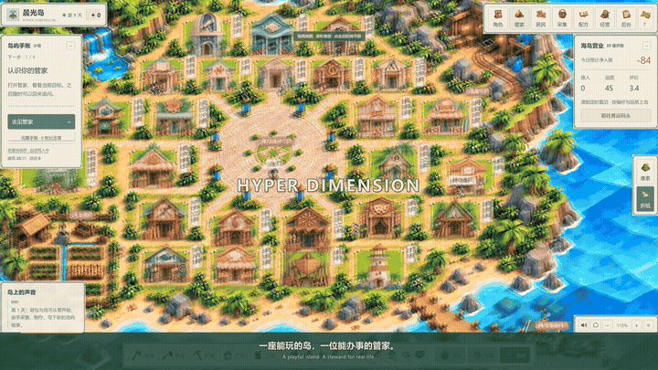

# Hyper Dimension

[English](README.en.md) · [中文](README.md) · [Deployment](island/DEPLOYMENT.md) · [Education module](README.education.md)

**An island that lives, with an agent that gets things done.**

Play, gather, craft and build a life alongside AI residents in a pixel or origami island. Your Hermes-powered steward also handles real-world tasks you delegate: reading work materials, organizing plans and saving documents. **V107 is a playable development snapshot**, with full product acceptance still in progress.

## 30-second gameplay video

**[▶ Watch / download the 30-second MP4](https://github.com/MkaliezZ/hyper-dimension/releases/download/v107/hyper-dimension-30s-stable.mp4)** · [Get the agent deployment bundle](https://github.com/MkaliezZ/hyper-dimension/releases/tag/v107)

A 30-second 4K film with an original instrumental score, bilingual captions and camera moves. It shows real DeepSeek resident decisions, a completed Coastal Kitchen challenge, and native Hermes reading a fictional work brief, saving a Word document and verifying its contents. The footage is edited to omit waiting; local paths are masked and no real user data appears.

**The current minigames are placeholder demonstrations. Gameplay, art and animation will continue to be refined; this is not final quality.** The film illustrates the product direction, not full product acceptance.

## On the island

- **Two visual styles, one simulation:** themed maps, buildings, characters, items and UI in pixel and origami.
- **An operating loop:** gather → craft → use / display / serve visitors → earn → improve facilities. An active game day lasts 900 seconds.
- **25 buildings, 15 AI residents and one steward:** farming, mining, workshops, a harbor and an event plaza, with pathfinding and work / needs-based routines.
- **Minigames and parties:** cooking, pottery, fishing, styling and puzzles; night markets, fishing gatherings, fairs, fashion shows and fireworks.
- **A Hermes steward:** conversation, recipe assignments, material preparation, recruitment and explicitly requested local document work, with execution records.
- **Server-managed saves:** file-backed state, protected resource and work receipts, backup / restore and fresh-browser recovery.
- **Local visiting and multiplayer foundations:** separate accounts and islands, traveling stewards and invited residents, social encounters and limited A2A. Cross-device steward bridging remains in development.

### AI life and real-world work

| A resident with their own goals | A steward delivering a real file |
| --- | --- |
|  |  |

The work brief is fictional. Hermes actually reads it, calculates a 12-carton restock and CNY 216 budget, then saves a usable Word document. The file is verified, not merely mentioned in chat.

### Actual screenshots

| Origami island | Pixel island |
| --- | --- |
|  |  |

| Coastal kitchen | The patient potter |
| --- | --- |
|  |  |

## Deploy with your agent

The repository and Release bundle include source, assets, pinned dependencies and a deployment protocol. **No installer or specific agent brand is required.** Your development agent needs terminal and file access.

1. Clone the repository and enter island/, or extract the Agent Source release bundle.
2. Ask your agent to read AGENTS.md, deploy.json and DEPLOYMENT.md.
3. Use Node.js 24 (recommended) and Python 3.11. Rebuild the runtime on the target machine.

Windows PowerShell:

    cd island
    node tools/agent-deploy.mjs plan
    node tools/agent-deploy.mjs doctor --python=python
    node tools/agent-deploy.mjs setup --python=python --offline
    node tools/agent-deploy.mjs verify
    node tools/agent-deploy.mjs run --mode=lan

macOS Terminal:

    cd island
    node tools/agent-deploy.mjs plan
    node tools/agent-deploy.mjs doctor --python=python3.11
    node tools/agent-deploy.mjs setup --python=python3.11 --offline
    node tools/agent-deploy.mjs verify
    node tools/agent-deploy.mjs run --mode=lan

The default local visiting URL is http://127.0.0.1:4175/play; local server output provides first-registration information. For standalone play, use run --mode=pixel (4173) or run --mode=origami (4174). The independent minigame collection is at /src/arcade.html. Follow the deployment guide to explicitly enable LAN listening.

Setup creates an empty private .env.local. Add your own DEEPSEEK_API_KEY if desired; never commit it. Local gameplay and rules can be checked without a key, but that does not establish AI connectivity. The configured model is deepseek-flash, without a Pro fallback.

## Platform and acceptance status

| Platform | Verified scope |
| --- | --- |
| Windows x64 | Independent V107 extraction, offline setup, 659 rule checks, and both themes in standalone / LAN gathering and save-reopen checks. |
| macOS 14+ Apple Silicon / Intel | Deployment protocol, conditional dependency closure and packaged file integrity; physical Mac execution remains unverified. |

V107 fixes obsolete work destinations after ingredient availability changes during a resident's journey. Both themes passed automated native Hermes / Flash recipe assignments from zero inventory, physical travel, crafting, protected delivery and fresh-browser restore. The economy also passed 12 domain scenarios of 30 game days each; this does not validate every live AI, recruitment and event economy together.

Outstanding work includes cross-device steward bridging, broader human and multi-device testing, minigame polish, ten real parent / sub-agent cooperative events and OPC newcomer course validation. **This is a runnable development snapshot, not a completed commercial release.** See [validation notes](island/docs/VALIDATION.md).

## Repository layout

    island/                  Current island game, agent runtime, assets and tests
      AGENTS.md              Agent deployment entry point
      deploy.json            Machine-readable deployment protocol
      src/ · server/         Frontend and local services
      public/ · vendor/      Dual-theme assets and pinned dependencies
      docs/                  Screenshots, provenance and validation notes
    src/hyper_dimension/      Existing education business module
    web/ · migrations/       Education frontend baseline and database migrations
    README.education.md      Existing education setup and documentation

Full integration between the island and education modules remains in progress. The education code and history have been preserved.

## Development and data

Run npm test inside island/, or node tools/agent-deploy.mjs verify for deployment checks. Browser checks are documented in the deployment guide. Before an update, stop this project's writers and create and verify a private backup. Do not copy a Windows virtual environment onto macOS.

This public repository excludes credentials, real account saves, conversation history, student records, production logs and installed runtimes. Requested document work and model conversations use the services you configure; provide only the context you intend to share. See [privacy and publication scope](island/docs/PRIVACY.md).

## License and credits

First-party code and documentation follow the existing [MIT License](LICENSE). Hermes Agent, Playwright, Fusion Pixel Font and Python dependencies retain their own licenses; see [third-party notices](island/THIRD_PARTY_NOTICES.md). Artwork provenance is described in [asset notes](island/docs/ASSETS.md). The project's MIT license does not replace third-party terms.
