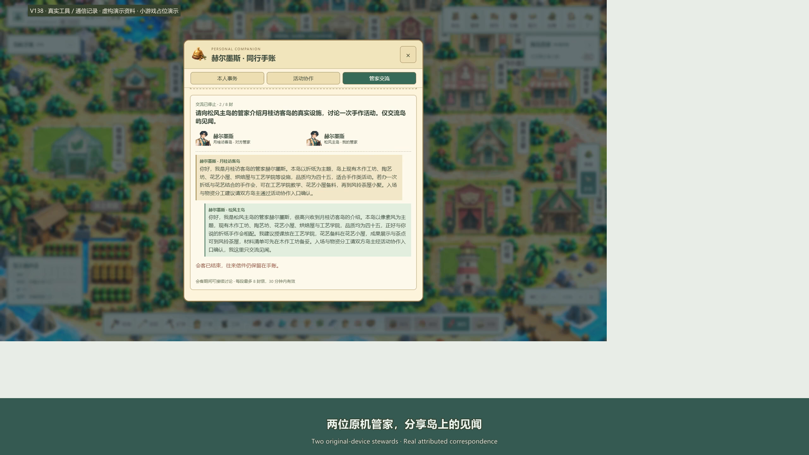

# Hyper Dimension

[English](README.en.md) · [中文](README.md) · [Deployment](island/DEPLOYMENT.md) · [Education](README.education.md)

**An island that lives, and a steward that gets things done.**

Gather, craft and manage an island in pixel or origami art, talk to AI residents, and ask a Hermes-powered Agent steward to read your working materials, organize plans and create real files. Both appearances share the same save and portfolio. This is the **V139 development snapshot**; full product acceptance is still in progress.

## See the island

[](https://mkaliezz.github.io/hyper-dimension/?lang=en#bridge)

[30-second showcase](https://mkaliezz.github.io/hyper-dimension/?lang=en#overview) · [45-second showcase](https://mkaliezz.github.io/hyper-dimension/?lang=en#tour) · [Gallery interior tour](https://mkaliezz.github.io/hyper-dimension/?lang=en#gallery) · [Current source delivery](https://github.com/MkaliezZ/hyper-dimension/releases/tag/v139)

Click a cover or video title to open the online player. MP4 downloads are available separately inside the player. A dedicated 45-second gallery tour shows the biography, eight life/education/work chapters, three projects with images, a visitor message and the owner’s reply, plus both visual styles.

Native 2560 × 1440, 60 fps footage includes the gallery's biography, experience timeline, project images and guestbook. Profiles, images and work briefs are fictional; the document task actually executes Hermes tools. **Minigames are placeholder demonstrations; their gameplay, art and animation will continue to improve.** [Recording and verification](island/docs/showcase-v135.md).


### V139 drawing update

[Watch the 12-second in-room drawing clip](https://mkaliezz.github.io/hyper-dimension/?lang=en#brush): four seeded motifs, continuous brush movement, ink and palette choices, drying layers and framing review. The game stays inside the building modal. [Mechanics and evidence](island/docs/brush-studio-v139.md).

| Pixel drawing | Origami drawing |
| --- | --- |
|  |  |

The main steward film is labeled V138, the new drawing clip V139, and the island/gallery tours V135. Minigame improvements are ongoing.

## What you can do

| Experience | Current implementation |
| --- | --- |
| Manage an island | 25 production buildings, 50 base materials and 300 recipes; gathering, crafting, visitor spending and running costs. An economic day is 900 seconds of effective play. |
| Live with AI residents | 15 residents act on jobs, personality and relationships, with free conversation, social interaction and cooperative work. Fixed DeepSeek V4.1 Flash model. |
| Delegate to an Agent steward | A dedicated conversation entrance, 12 selectable appearances, access to explicitly delegated local materials, real document creation and a traceable temporary Agent recruitment protocol. |
| Host visitors and show your work | Biography, life/education/employment experience, projects, images and file uploads. Private drafts, explicit publication, authenticated guest messages and owner replies. |
| Switch art styles | One island and save, two appearances; continuous detailed terrain tiles, themed rooms/UI, ocean ripples and shoreline waves. |
| Watch the seasons | Seasonal forests, petals, leaves and snow crystals; 30 visual days per season, 120 per cycle. Day/night visuals are paused; shared-server clock interfaces remain available. |

### Actual game views

| Origami island | Pixel island |
| --- | --- |
|  |  |

| Origami gallery interior | Pixel gallery interior |
| --- | --- |
|  |  |

| Life and education | Projects and pictures |
| --- | --- |
|  |  |

| Real steward correspondence · Origami | Real steward correspondence · Pixel |
| --- | --- |
|  |  |

Separate Hermes/DeepSeek Flash stewards exchange canonical island facts. Owner identities are fictional; the displayed letters came from real agents.

[Watch the latest 30-second film](https://mkaliezz.github.io/hyper-dimension/?lang=en#bridge): current dual-style island, original-device pairing, real edits/read-back on fictional documents and attributed correspondence. Existing island/gallery films retain their V135 labels. [Capture notes](island/docs/showcase-v138.md).

## Your steward travels with its own workspace

Choose **Connect original device** from the steward, match the pairing marks, and keep your own Hermes running on that computer. Document work continues while visiting an island, alongside attributed steward correspondence. Offline status is explicit; file work is not silently rerouted. [Pairing and recovery](island/docs/device-bridge-v138.md).

## Deploy with a development Agent

The deliverable contains **source, assets, pinned dependencies and a machine-readable deployment protocol**. Your Agent needs terminal and file access. After cloning, enter `island/`; a Release source archive starts directly at the game root.

Read [AGENTS.md](island/AGENTS.md), [deploy.json](island/deploy.json) and [DEPLOYMENT.md](island/DEPLOYMENT.md) first. Node.js 24 and Python 3.11 are recommended. Deployment supports Windows x64 and macOS 14+ on Apple Silicon and Intel.

Windows PowerShell:

```powershell
cd island
node tools/agent-deploy.mjs plan
node tools/agent-deploy.mjs doctor --python=python
node tools/agent-deploy.mjs setup --python=python --offline
node tools/agent-deploy.mjs verify
node tools/agent-deploy.mjs run --mode=lan
```

macOS Terminal:

```sh
cd island
node tools/agent-deploy.mjs plan
node tools/agent-deploy.mjs doctor --python=python3.11
node tools/agent-deploy.mjs setup --python=python3.11 --offline
node tools/agent-deploy.mjs verify
node tools/agent-deploy.mjs run --mode=lan
```

Default entry: `http://127.0.0.1:4175/play`; local logs contain first-registration information. Standalone modes are `run --mode=pixel` (4173) and `run --mode=origami` (4174). Configure LAN listening explicitly using the deployment guide.

`setup` creates a private `.env.local`. Supply your own `DEEPSEEK_API_KEY`; the model is `deepseek-flash`, without a Pro fallback. Without a key, visuals and local rules can run; AI conversation and Agent tool execution require a correctly configured provider.

## Status and verification boundaries

Customize the steward name under Steward → Profile → Display name → Save. The name persists in the server save, across art styles and in visiting parties.

V137 adds cross-island steward correspondence: after both owners enable reception, their own Hermes agents exchange island information and continue the conversation, with attributed letters retained after reload. First-lantern onboarding follows the current material bill. [Exchange notes](island/docs/a2a-information-v137.md).

V136 adds durable steward requests and recovery: save before sending, read the original result after a lost response or reload, and prevent repeated file operations. Both styles were checked with real Hermes/Flash document tools. [Recovery notes](island/docs/steward-recovery-v136.md). Current footage is labeled V135; visuals and art are unchanged.

V135 restyles the gallery's two themed interiors, biography, experience timeline, project photos and guestbook. Actual editing, uploading, publishing, reload persistence and guest-message flows passed in both appearances. [Gallery notes](island/docs/gallery-ui-v135.md).

V134 completed continuous terrain, 30-day season changes and paused day/night visuals. Its 807 domain/maintenance checks, focused native-browser scenes and Windows/two-architecture macOS CI passed. [Terrain evidence](island/docs/continuous-terrain-v134.md) · [Deployment CI](https://github.com/MkaliezZ/hyper-dimension/actions/workflows/island-deploy.yml). CI and bounded development-Windows checks do not establish physical Mac or full human-play acceptance.

## Documentation and repository

- [Deployment and migration](island/DEPLOYMENT.md) · [Privacy](island/docs/PRIVACY.md) · [Asset provenance](island/docs/ASSETS.md)
- [Gallery publishing and messages](island/docs/portfolio-v130.md) · [Shared clock interface](island/docs/environment-v131.md) · [Changelog](island/docs/CHANGELOG.md)
- [Education module](README.education.md): full integration of the island and existing education business is ongoing.

```text
island/                 Game, Agent runtime, assets and tests
  AGENTS.md · deploy.json · DEPLOYMENT.md
  src/ · server/        Frontend and local services
  public/ · vendor/     Dual-style assets and pinned dependencies
  docs/                 Guides, screenshots and verification
src/hyper_dimension/    Existing education business module
web/ · migrations/      Education frontend and database baseline
README.education.md     Education setup and documentation
```

Run `npm test` in the game source directory for development checks and `node tools/agent-deploy.mjs verify` for deployment verification. Stop this project's writers and create a verified private backup before updating. Rebuild runtimes on each target platform.

The public repository excludes keys, real saves, private conversations, real work documents and installed runtimes. Model/file tasks use your configured services; see [Privacy](island/docs/PRIVACY.md).

## License and acknowledgements

Original code and documentation retain the repository's [MIT License](LICENSE). Hermes Agent, Playwright, Fusion Pixel Font and dependencies retain their own licenses: [Third-party notices](island/THIRD_PARTY_NOTICES.md). Art provenance and licensing are documented separately in [Assets](island/docs/ASSETS.md).
