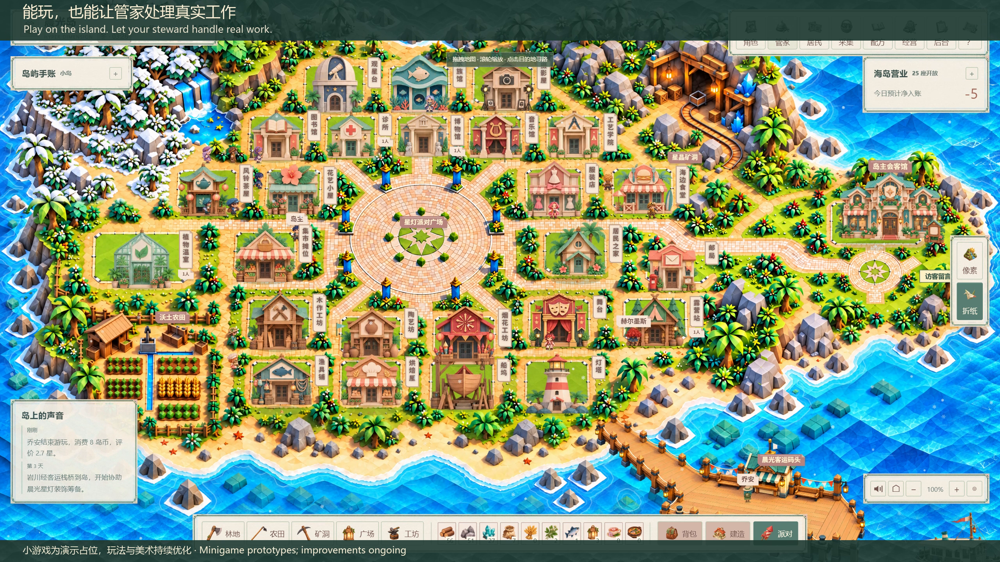

# Hyper Dimension

[中文](README.md) · [English](README.en.md) · [部署指南](island/DEPLOYMENT.md) · [教培模块](README.education.md)

**一座会生活的岛，和一位能办事的管家。**

在像素与折纸双画风的小岛上采集、制作、经营，与 AI 居民交流；也能委托基于 Hermes 的 Agent 管家读取资料、整理计划、创建真实工作文件。两种画风共用同一存档和个人档案。当前为 **V149 开发快照**，完整产品验收仍在进行。

## 当前更新 · V149

主题鼠标全面覆盖；双画风在同一小岛内切换并持久化；会客厅扩大地图、重排侧栏；联机 NPC 停步与转向按服务器真实状态展示。会客馆加入预加载。[实现与回归证据](island/docs/ui-reliability-v148.md)。

## 看一眼这座岛

[](https://mkaliezz.github.io/hyper-dimension/#living)

[30 秒宣传片](https://mkaliezz.github.io/hyper-dimension/#living) · [45 秒完整演示](https://mkaliezz.github.io/hyper-dimension/#tour) · [45 秒会客馆内部导览](https://mkaliezz.github.io/hyper-dimension/#gallery) · [源码包与版本记录](https://github.com/MkaliezZ/hyper-dimension/releases)

点击封面直接在线播放；下载入口在播放器中单独提供。最新 30 秒影片为实际页面录制：双画风地图、AI 居民交谈、管家多形象、真实 Word 文档任务、主子 Agent 协作、房屋内小游戏及完成后的奖励。

影片采用 2560 × 1440 / 60 fps 与原创 BGM；录制源码为 V145，当前源码为 V149。个人经历、项目图片与工作资料均为虚构示例，Hermes 文档任务实际执行。**小游戏目前是占位演示，玩法、美术与动画将继续优化。** [视频验证记录](https://github.com/MkaliezZ/hyper-dimension/blob/main/showcase/media/v145-living-verification.json)。

### V144 附近居民的声音

邻近居民的脚步、工作和交谈随距离与左右位置变化；只保留四名附近声源，暂停不补播。双画风实际声音路由与16项专项通过。[声音规则与验证](island/docs/spatial-sound-v144.md)。

### V143 经营趋势

成熟小岛允许小幅挂机盈利。经营手账新增近期日均接待净收益、主动收支与完整结余；双风格 12 场景各 60 日模拟通过。[经营规则与验证](island/docs/economy-v143.md)。

### V142 双灶切配

客单备料后，在食材上向下划刀；切配精度与双灶火候共同决定品质。手机触摸、空格操作、刷新续玩和单次材料结算均已在双画风通过实际流程。[玩法与验收](island/docs/kitchen-v142.md)。

### V141 共绘星图夜集

[](https://mkaliezz.github.io/hyper-dimension/#night)

[观看 16 秒新玩法片段](https://mkaliezz.github.io/hyper-dimension/#night)：1440p / 60 fps、原生岛屿弹窗、居民到场、四盏飞行星灯和实际结算，配原创 BGM。小游戏演示仍在继续优化。

观察海风和云带，瞄准并放飞四盏星灯，每盏可空中修正一次；与真实到场的居民一起点亮星图、领取纪念品。飞行进度可保存和刷新恢复，费用与奖励保持原规则。两种画风的真正零起点到首场夜集、空浏览器恢复及878项默认回归已通过。[玩法与验证](island/docs/night-sky-v141.md)。

### 地图点击与居民身份修复

姓名牌、人物与档案按同一居民编号对应；重叠时按显示顺序选择，悬停可查看姓名。像素与折纸两套画风的全部15名AI居民及管家已通过地图点击验证。 [验证说明](island/docs/npc-map-identity.md)。

修复会客准备阶段提前暂停，以及提示叠加后遗留的点击锁；两画风空地移动、建筑到达及进入房间已复核。[交互修复](island/docs/map-navigation-v141.md)。

### V140 主子 Agent 活动流程

真实 Hermes 主子 Agent 确认制作分工，伙伴乘船到岛、沿路进工坊、交付星灯；邀请居民并举办夜集后，贡献、工资与离岛记录随存档保存。修复交接重复取消和迟到回调。[流程与验证](island/docs/recruitment-v140.md)。

### V139 绘画玩法更新

[观看 12 秒房屋内绘画片段](https://mkaliezz.github.io/hyper-dimension/#brush)：四类随机风物、连续运笔、配色与墨量、晾干与装裱评审。小游戏仍在房屋弹窗内进行。[玩法与验证](island/docs/brush-studio-v139.md)。

| 像素绘画 | 折纸绘画 |
| --- | --- |
|  |  |

管家主宣传片保留 V138 标记，新绘画片段标记 V139，小岛／会客馆导览保留 V135 标记。小游戏的玩法、美术与动画仍在继续优化。

## 你能做什么

| 体验 | 当前内容 |
| --- | --- |
| 经营小岛 | 25 种生产建筑、50 种基础素材、300 个配方，采集、制作、游客消费与岛务开支。每经营日为 900 秒有效游戏时间。 |
| 与 AI 居民生活 | 15 位 AI 居民根据职业、性格和关系行动；支持自由交流、居民之间的对话与共同工作。模型固定 DeepSeek V4.1 Flash。 |
| 委托 Agent 管家 | 独立对话入口、12 种可选形象；可读取主动委托的本机资料、创建文档，并通过可追踪的任务协议招募临时 Agent 伙伴。 |
| 展示自己、接待访客 | 岛主会客馆展示介绍、人生／教育／就业经历、项目与图片；支持文件上传、私有草稿、主动发布、登录访客留言与岛主回复。 |
| 切换两种美术 | 同一小岛切换像素／折纸外观；连续高清分块地形、主题房间和 UI、海面水纹与近岸浪。 |
| 看四季变化 | 季节树木、花瓣、落叶和雪晶；每季 30 个视觉日，完整四季 120 日。昼夜视觉效果暂时关闭，统一服务器时钟接口保留。 |

### 实际运行画面

| 折纸海岛 | 像素海岛 |
| --- | --- |
|  |  |

| 折纸会客馆内部 | 像素会客馆内部 |
| --- | --- |
|  |  |

| 人生与教育经历 | 项目和图片 |
| --- | --- |
|  |  |

| 管家之间的真实回信 · 折纸 | 管家之间的真实回信 · 像素 |
| --- | --- |
|  |  |

双方各自的 Hermes／DeepSeek Flash 管家，交换服务端确认的岛屿见闻。截图使用虚构测试身份，回信来自真实 Agent。

[在线播放 30 秒演示（画幅修正版）](https://mkaliezz.github.io/hyper-dimension/#bridge)：双风格当前岛屿、连接原机、真实虚构文档修改与回读、两位原机管家的通信记录。已有小岛／会客馆视频保留 V135 标记。[录制说明](island/docs/showcase-v138.md)。

## 管家随行，工作区也随行

在管家入口选择「连接原机」，核对配对标记后，自己的 Hermes 管家在原机处理文件；拜访另一座岛时仍可继续委托，也能与岛主的管家交换岛屿见闻。原机离线会明确显示，不会把文件工作转交到另一台电脑。[连接与恢复说明](island/docs/device-bridge-v138.md)。

## 交给任意开发 Agent 部署

交付形态是**源码、资源、固定依赖和机器可读部署协议**。Agent 需要有终端和文件权限。克隆仓库后进入 `island/`；若解压 Release 源码包，直接在解压目录操作。

先让 Agent 阅读 [AGENTS.md](island/AGENTS.md)、[deploy.json](island/deploy.json) 和 [DEPLOYMENT.md](island/DEPLOYMENT.md)。推荐 Node.js 24、Python 3.11；支持 Windows x64 与 macOS 14+ 的 Apple Silicon／Intel。

Windows PowerShell：

```powershell
cd island
node tools/agent-deploy.mjs plan
node tools/agent-deploy.mjs doctor --python=python
node tools/agent-deploy.mjs setup --python=python --offline
node tools/agent-deploy.mjs verify
node tools/agent-deploy.mjs run --mode=lan
```

macOS Terminal：

```sh
cd island
node tools/agent-deploy.mjs plan
node tools/agent-deploy.mjs doctor --python=python3.11
node tools/agent-deploy.mjs setup --python=python3.11 --offline
node tools/agent-deploy.mjs verify
node tools/agent-deploy.mjs run --mode=lan
```

默认入口为 `http://127.0.0.1:4175/play`，本机日志提供首次注册信息。单机入口使用 `run --mode=pixel`（4173）或 `run --mode=origami`（4174）。局域网监听需按部署指南显式配置。

`setup` 创建私有 `.env.local`。按需填写自己的 `DEEPSEEK_API_KEY`，模型使用 `deepseek-flash`，无 Pro 回退。未配置密钥可运行画面和本地规则，AI 对话与 Agent 工具执行需要正确配置后才能使用。

## 当前状态与验证范围

管家支持自定义展示姓名：管家 → 管家档案 → 展示姓名 → 保存档案；名称随服务端存档保留，切换画风与随行登岛继续使用。

V137 添加跨岛管家信息交流：双方开启接收后，各自的 Hermes 管家可以交换岛上见闻并接续讨论，刷新后保留署名与信件。首盏灯的新手引导同步当前材料配方。[交流说明](island/docs/a2a-information-v137.md)。

V136 补齐管家委托的持久化与异常恢复：保存后寄出，丢失回复或刷新时核对原结果，避免重复操作文件。双画风已使用真实 Hermes／Flash 文档工具验证。[恢复说明](island/docs/steward-recovery-v136.md)。当前影片录于 V135，画面与美术保持一致。

V135 调整会客馆的双风格展厅、档案排版、经历时间线、项目照片与留言页。双画风实际编辑、上传、发布、刷新恢复和访客留言流程通过。[会客馆说明](island/docs/gallery-ui-v135.md)。

V134 完成连续地形、30 日换季和昼夜视觉暂停，807 项领域／维护检查、相关原生浏览器场景及 Windows／两架构 macOS CI 通过。[地形验证](island/docs/continuous-terrain-v134.md) · [部署 CI](https://github.com/MkaliezZ/hyper-dimension/actions/workflows/island-deploy.yml)。CI 与开发 Windows 机器的限定场景检查，不等于实体 Mac 和完整真人游戏验收。

## 文档与仓库

- [部署与数据迁移](island/DEPLOYMENT.md) · [隐私边界](island/docs/PRIVACY.md) · [素材来源](island/docs/ASSETS.md)
- [会客馆发布与留言](island/docs/portfolio-v130.md) · [共享时令接口](island/docs/environment-v131.md) · [版本记录](island/docs/CHANGELOG.md)
- [教培模块](README.education.md)：海岛与原有教培业务的完整整合仍在进行。

```text
island/                 Game, Agent runtime, assets and tests
  AGENTS.md · deploy.json · DEPLOYMENT.md
  src/ · server/        Frontend and local services
  public/ · vendor/     Dual-style assets and pinned dependencies
  docs/                 Guides, screenshots and verification
src/hyper_dimension/    Existing education business module
web/ · migrations/      Education frontend and database baseline
README.education.md     Education setup and documentation
```

开发检查在海岛源码目录执行 `npm test`，部署校验执行 `node tools/agent-deploy.mjs verify`。更新前停止本项目写入进程，并创建、验证私有备份；运行时应在各目标平台重建。

公库不包含密钥、真实用户存档、聊天历史、现实工作文档或已安装运行时。模型与文件任务使用你配置的服务；详见[隐私说明](island/docs/PRIVACY.md)。

## 许可与致谢

原创代码与文档沿用仓库 [MIT License](LICENSE)；Hermes Agent、Playwright、Fusion Pixel Font 与各依赖保留自身许可证，见[第三方说明](island/THIRD_PARTY_NOTICES.md)。美术来源与许可另见[素材说明](island/docs/ASSETS.md)。
