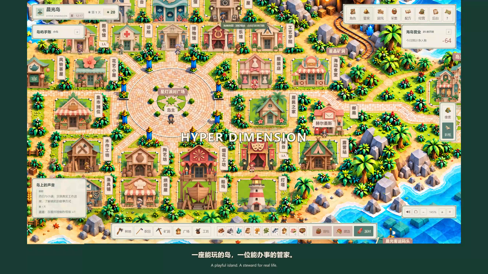
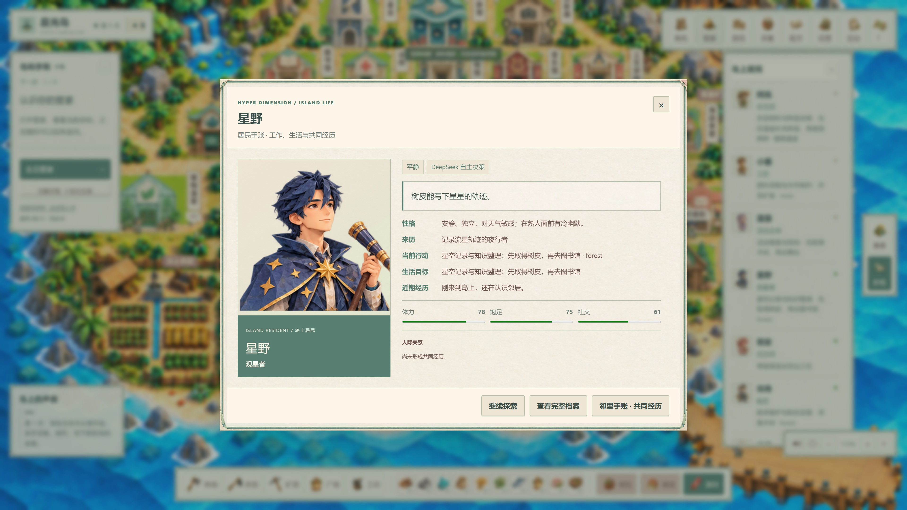
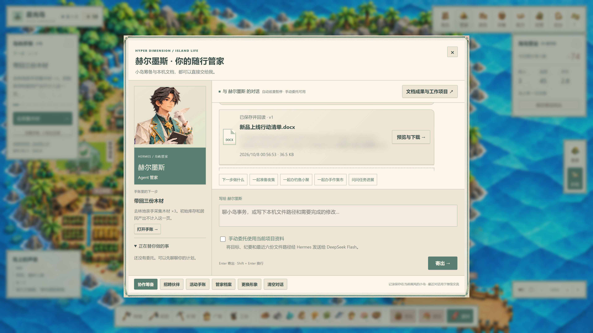
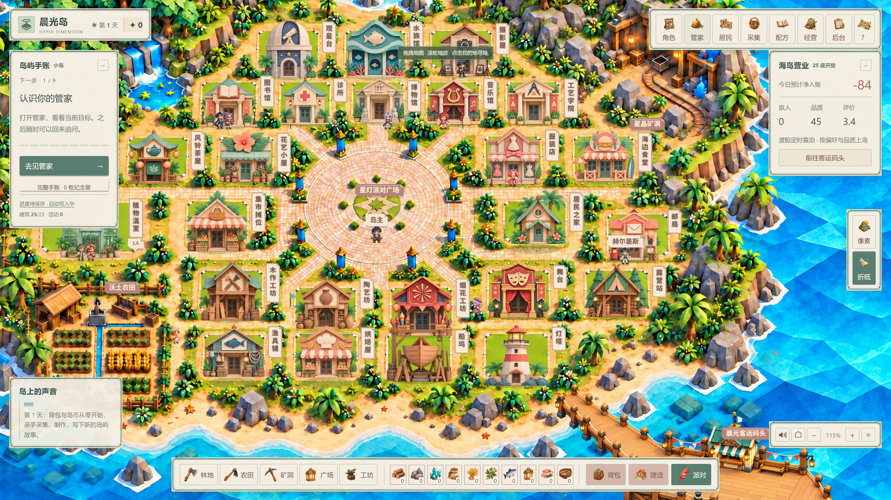
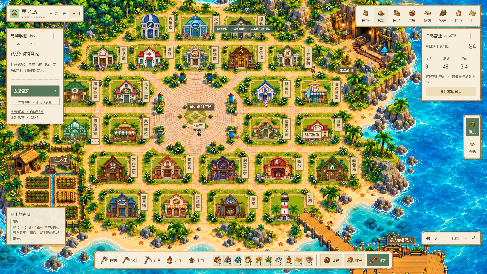

# Hyper Dimension

[中文](README.md) · [English](README.en.md) · [部署指南](island/DEPLOYMENT.md) · [教培模块](README.education.md)

**一座会生活的岛，和一位能办事的管家。**

在折纸与像素双画风的小岛上采集、制作、经营，与 AI 居民共同生活；也能让基于 Hermes 的 Agent 管家读取工作资料、整理计划、保存文档，处理你主动委托的现实任务。当前公开版本为 **V110 开发快照**，可本地部署；完整产品验收仍在进行。

V110 修复连连看与三消结果未确认时提前关闭的问题，保留成绩与重试入口。[查看结算恢复说明](island/docs/classic-settlement-v110.md)。

V109 已更新双画风登船舷梯、船体靠泊位置与人物遮挡。[查看码头改动与实机画面](island/docs/harbor-art-v109.md)。下方视频录制于 V108。

## 实机演示：30 秒预览与 45 秒功能展示

**[▶ 播放 / 下载 30 秒 MP4](https://github.com/MkaliezZ/hyper-dimension/releases/download/v108/hyper-dimension-30s.mp4)** · [下载 Agent 部署包](https://github.com/MkaliezZ/hyper-dimension/releases/tag/v110)

2560 × 1440 / 60 FPS，原创器乐 BGM 与中英字幕。展示真实 AI 居民对话、管家多形象选择、Hermes 主子 Agent 分工、房屋弹窗内的海风双灶与通关结果，以及管家处理虚构工作资料、保存并回读 Word 文件。实机片段省略等待，没有真实用户资料。

[观看 45 秒功能展示](https://github.com/MkaliezZ/hyper-dimension/releases/download/v108/hyper-dimension-45s.mp4)，可看到男女形象选择、不同职业候选和主子 Agent 的实际协商。

**当前小游戏仅为占位演示，玩法、美术和动画将持续优化，不代表最终品质。** 视频是产品方向展示，不代表全部验收通过。

## 小岛里有什么

- **双画风、同一套逻辑**：折纸 / 像素地图、建筑、角色、物品与主题 UI。
- **经营循环**：采集 → 制作 → 使用 / 陈列 / 接待 → 收入 → 改善设施。每个有效游戏日为 900 秒。
- **25 座建筑、15 名 AI 居民和 1 位管家**：包含农田、矿洞、工坊、码头与活动广场；角色自动寻路，按工作与需求生活。
- **小游戏与派对**：烹饪、陶艺、钓鱼、搭配、拼图等建筑玩法；夜集、钓鱼聚会、集市、秀场与烟花活动。
- **Hermes 管家**：对话、配方分工、物资筹备、招聘，以及用户主动委托的本机文档工作；保留真实执行记录。
- **服务端存档**：文件存档、受保护的物资 / 作业回执、备份恢复与空浏览器重开；不只依赖浏览器缓存。
- **本地会客 / 联机基础**：独立账号与岛屿、携带管家和邀请同行居民、会客交流及受限 A2A。跨设备管家桥接等仍在完善。

V108 增加带立绘的主子 Agent 协商记录；小游戏完成提交暂未接受时保留结果与重试入口。Intel Mac 的 20 轮长测试改为按工作量设置时间预算，未减少断言。[三平台 CI 状态](https://github.com/MkaliezZ/hyper-dimension/actions/workflows/island-deploy.yml)。

### AI 生活与现实工作

| AI 居民自己的目标 | 管家交付真实文件 |
| --- | --- |
|  |  |

视频中的工作资料全部为虚构示例；管家实际调用工具，计算补货 12 盒、预算 216 元，并保存可打开的 Word 文档。没有用对话文字冒充文件。

### 运行截图

| 折纸海岛 | 像素海岛 |
| --- | --- |
|  |  |

| 海风双灶 | 一器一形 |
| --- | --- |
|  |  |

## 交给 Agent 部署

仓库与 Release 都包含游戏源码、资源、固定依赖及部署协议，**不需要安装器，也不绑定某一家 Agent**。开发 Agent 需要有终端和文件权限。

1. 克隆仓库后进入 island/，或解压 Release 中的 Agent 源码包。
2. 让 Agent 先读 AGENTS.md、deploy.json 和 DEPLOYMENT.md。
3. 使用 Node.js 24（建议版本）与 Python 3.11。在目标机器重建运行环境。

Windows PowerShell：

    cd island
    node tools/agent-deploy.mjs plan
    node tools/agent-deploy.mjs doctor --python=python
    node tools/agent-deploy.mjs setup --python=python --offline
    node tools/agent-deploy.mjs verify
    node tools/agent-deploy.mjs run --mode=lan

macOS Terminal：

    cd island
    node tools/agent-deploy.mjs plan
    node tools/agent-deploy.mjs doctor --python=python3.11
    node tools/agent-deploy.mjs setup --python=python3.11 --offline
    node tools/agent-deploy.mjs verify
    node tools/agent-deploy.mjs run --mode=lan

默认会客入口为 http://127.0.0.1:4175/play，本机日志提供首次注册所需信息。直接玩单机可使用 run --mode=pixel（4173）或 run --mode=origami（4174）。独立小游戏在 /src/arcade.html。需要局域网访问时，按部署指南显式设置监听地址。

setup 会创建空的私有 .env.local；按需填入自己的 DEEPSEEK_API_KEY，不要提交。未配置密钥时可先运行画面与本地规则，不能视为 AI 已接通。模型配置为 deepseek-flash，不回退到 Pro。

## 平台与验收边界

| 平台 | 当前证据 |
| --- | --- |
| Windows x64 | V107 独立解压、离线安装、659 项规则检查及双画风单机 / LAN 采集与存档重开通过。 |
| macOS 14+ Apple Silicon / Intel | 部署协议、两架构条件依赖和随包文件校验通过；实体 Mac 运行尚待验证。 |

V107 修复居民途中材料变化后仍去旧工位的问题。双画风真实 Hermes / Flash 的从零配方任务、实体行走、制作交付与空浏览器恢复已通过自动化验证。30 个游戏日 × 12 场景的领域经济模拟通过；它不等于全部真实 AI、活动与招聘联合经营验收。

完整产品仍有待办，包括跨设备管家桥接、更多真人与多设备测试、全部小游戏的体验打磨、十场真实主子 Agent 合作活动和 OPC 新人课程验证。**可运行开发快照，不宣称商业完成版。** 详见[验收说明](island/docs/VALIDATION.md)。

## 仓库结构

    island/                  当前海岛游戏、Agent 运行时、资源与测试
      AGENTS.md              Agent 部署入口
      deploy.json            机器可读部署协议
      src/ · server/         前端与本机服务
      public/ · vendor/      双画风资源与固定依赖
      docs/                  运行截图、来源及验收说明
    src/hyper_dimension/      原有教培业务模块
    web/ · migrations/       教培前端基线与数据库迁移
    README.education.md      原有教培说明与运行方式

海岛游戏与教培模块的完整业务整合仍在进行。原有教培代码与历史保留，没有被演示页面替代。

## 开发与数据

在 island/ 中运行 npm test，或用 node tools/agent-deploy.mjs verify 执行部署校验。带浏览器的专项验收见部署指南。更新前停止本项目写入进程，创建并验证私有备份；不要把 Windows 虚拟环境直接拷到 macOS。

公开仓库不包含密钥、真实账号存档、聊天历史、学生资料、生产日志或已安装运行时。管家处理主动委托的文件或模型对话时，会使用你配置的服务；请只授予你愿意提供的上下文。详见[隐私与发布边界](island/docs/PRIVACY.md)。

## 许可与致谢

原创代码与文档沿用仓库 [MIT License](LICENSE)。Hermes Agent、Playwright、Fusion Pixel Font 及 Python 依赖保留各自许可证，见[第三方说明](island/THIRD_PARTY_NOTICES.md)。双画风美术的来源记录见[素材说明](island/docs/ASSETS.md)，第三方许可不能由项目 MIT 声明替代。
