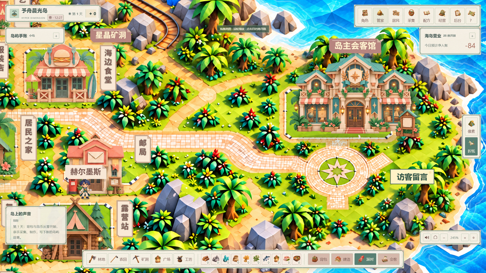
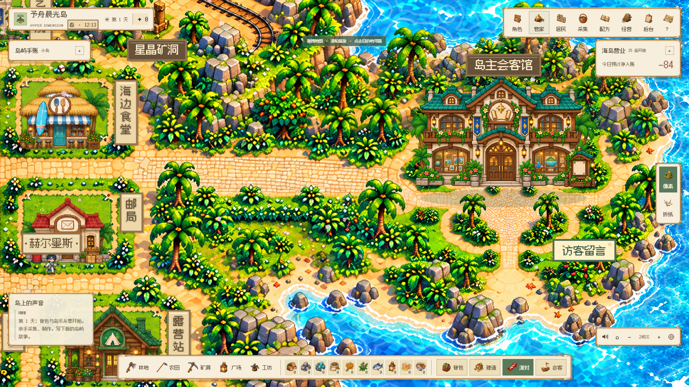

# V134 · 连续主岛与会客馆 / Continuous mainland and gallery

## 本轮调整

按现有房屋排布重绘像素／折纸两套连续底图。原来主岛与会客馆之间的独立小岛、桥梁和落脚点叠层停止使用；东侧改为同一片陆地上的宽庭院道路，连接会客馆门口与访客留言板。25 个生产建筑 ID、原地块坐标与经营规则保留；会客馆向上调整 24 个世界坐标单位，让出门前道路。

- 两套画风各 15 张原生高清区域画，共 30 张；每张覆盖固定坐标，实际原生尺寸至少是对应世界区域的 2.79 倍。
- 地形范围 1856 × 1024 世界坐标，5 列 × 3 行；相邻素材各保留 32 单位参考重叠，使用总权重为一的羽化拼接。
- 完整中央广场沿用原有整块高清素材；总览由实际运行分块合成，不混用旧整图。放大时按视野加载细节。
- 主岛到会客馆的通行道路按各画风的真实铺装位置单独校准，建筑、树丛和海水保留阻挡。
- 移除昼夜画面变色、夜间海面变暗、灯塔光束与夜间粒子；四季重绘林地和花瓣／落叶／雪动画继续运行。
- 每个视觉日 15 分钟，每季 30 个视觉日，四季一轮 120 日。本地旧 7 日时钟迁移保留当前季节、小时与时钟 ID；总服务器协议仍保留，中央时钟配置不会被本地升级覆盖。经营仍按 900 秒有效游戏时间计日。

## 实际游戏截图

截图来自原生浏览器中的隔离虚构岛屿，使用正常 UI 切换画风、放大和拖拽。

| 折纸连续庭院 | 像素连续庭院 |
| --- | --- |
|  |  |

| 折纸全岛 | 像素全岛 |
| --- | --- |
|  |  |

## 验证范围

本次 30 项相关领域检查通过：地形完整覆盖与权重、真实原生图片尺寸及摘要、30 日季节边界、本地时钟并发迁移、中央配置保留、会客馆资料持久化、双画风铺装道路寻路与海水阻挡。

双画风实际会客馆页面、8 段经历、3 项项目、3 张图片均能正常展示。两套主岛到门口的路径各为 37 个寻路点。四季与昼夜视觉暂停的原生页面验证共 18 项通过；固定时刻比较白天、夜晚和黄昏渲染，画面保持一致。每套 360 帧采样，p95 帧间隔约 6.2 ms，未出现超过 50 ms 的间隔。这里的帧数据来自开发 Windows 机器的限定场景，不能代表全部设备或完整游戏长期运行。

这些是局部验证。实体 Mac、完整产品人工验收、多岛长期运行与新宣传视频仍需分别完成；V108 宣传视频仅保留作历史展示。小游戏仍是占位演示。

美术尺寸、坐标、生成记录与 SHA-256 见 [terrain-art-v134.json](terrain-art-v134.json)；实际总览来源见 [terrain-previews-v134.json](terrain-previews-v134.json)。总服务器接口见 [环境协议](environment-v131.md)。

## English

V134 repaints 30 original regional terrain images around the existing building layout. The gallery is part of continuous mainland terrain, with a broad paved garden boulevard replacing the separate island and bridge layers. All 25 production building IDs and parcel coordinates remain unchanged; the gallery moves upward by 24 world units to keep the entrance route clear.

The 1856 × 1024 atlas uses a 5 × 3 grid per appearance, shared crop coordinates, 32-unit reference overlaps and normalized feather weights. Every original regional output has at least 2.79 native pixels per world unit; no simple upscaling is used. The complete existing plaza is retained. Runtime overviews are composed from the same tiles used at close zoom.

Day/night scene coloring, night ocean dimming, lighthouse beams and night-only particles are paused. Original seasonal forest art and falling animations remain active. A visual day lasts 15 minutes; each season lasts 30 days, with a 120-day cycle. Local legacy clocks migrate once while preserving their current season and hour. Central clock settings remain authoritative. The economy retains its independent 900-second effective-play day.

Focused evidence: 30 domain checks, two actual native gallery/theme-switch runs, two 37-point mainland-to-entrance paths, persistent fictional portfolio images and 18 environment rendering cases passed. Each appearance's 360-frame sample had approximately 6.2 ms p95 spacing and no interval above 50 ms. These bounded Windows measurements do not claim physical Mac or complete product acceptance. The V108 showcase remains historical; the minigames remain placeholder demonstrations.

兼容地形加载 11 组场景、联机会客／WebGL 丢失恢复／无 WebGL 回退 4 项验证通过。冷启动兼容加载曾有 103–139 ms 的最大帧间隔；上面的 6.2 ms 是加载完成后的限定场景采样，不能解释为所有加载过程都无卡顿。 / Eleven terrain-loading cases and four shared-room/WebGL recovery/fallback checks passed. Cold compatibility loading recorded maximum intervals of 103–139 ms; the steady-scene frame sample above does not claim hitch-free startup.
