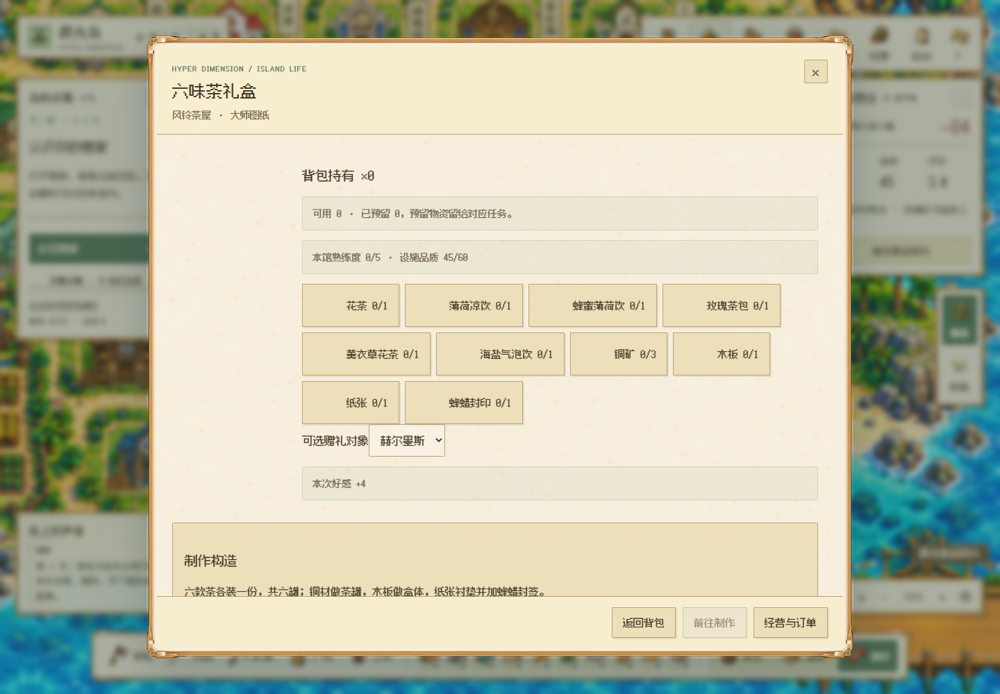
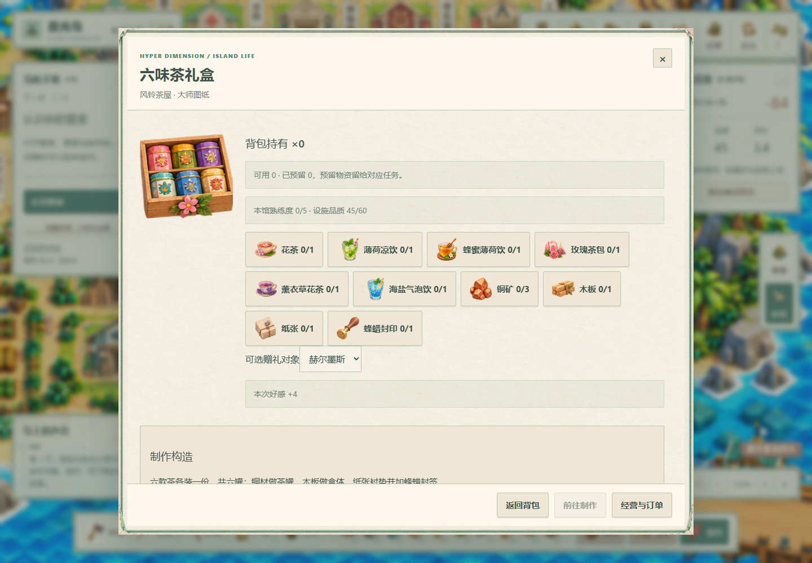
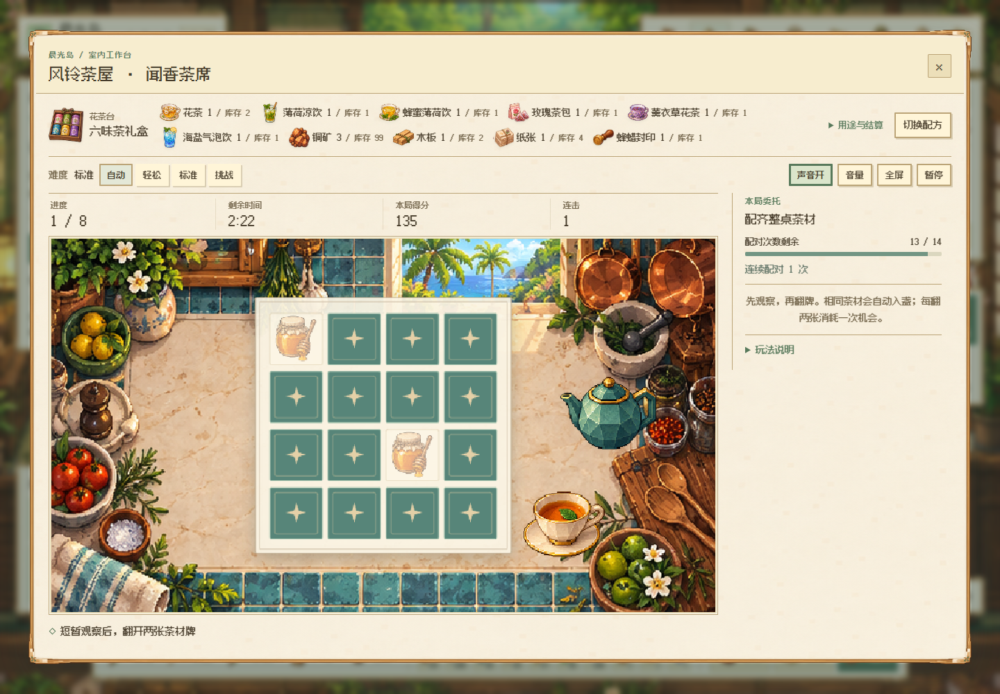
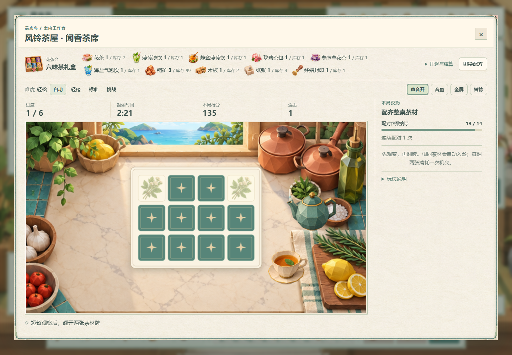
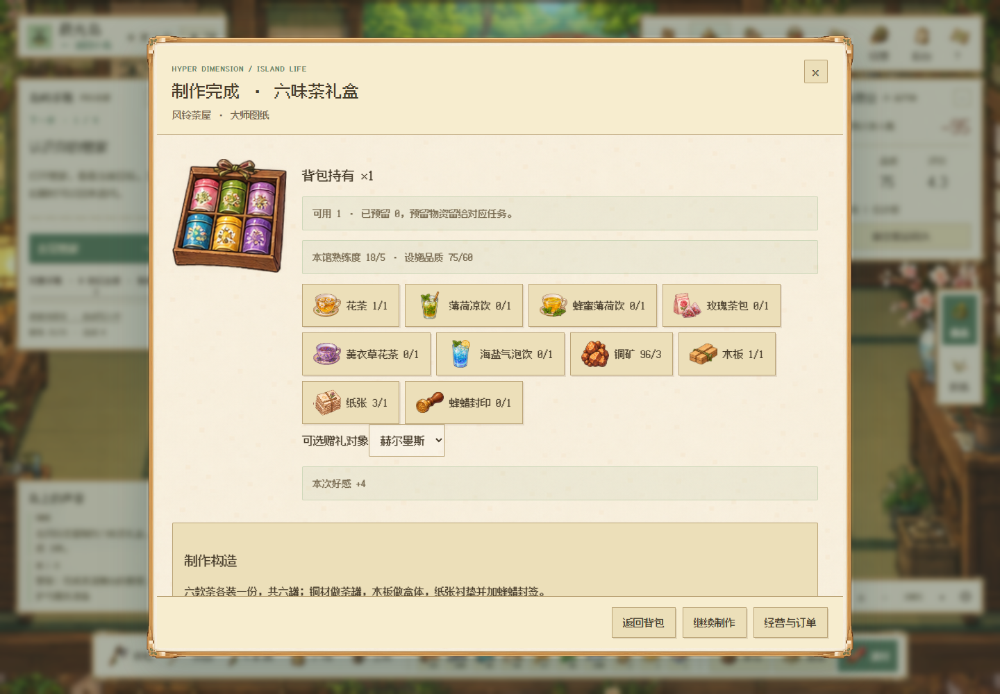
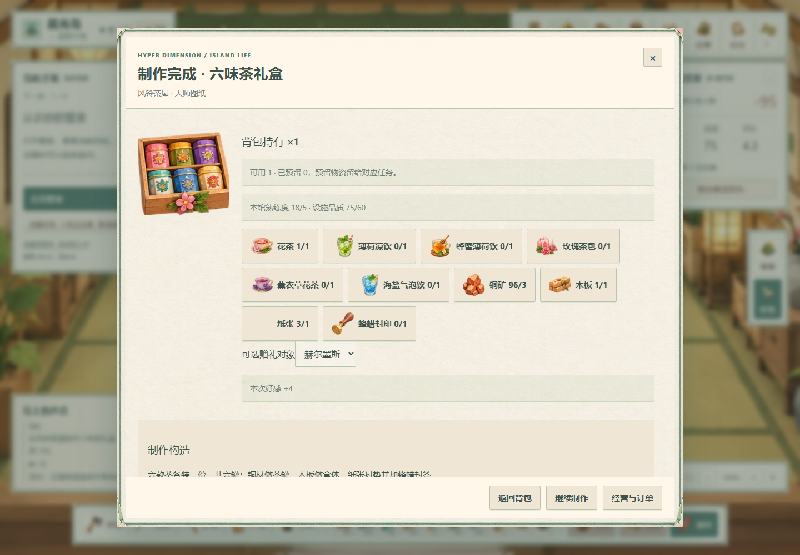

# V123 · 300 项制作材料与制品用途

## 中文

25 座建筑的 300 项制品现在都有单独定义的材料单、制作构造说明和解锁／使用类型；不再按轮转素材池自动拼材料。50 项基础素材均有实际消费者。物品 ID 与现有两套图集位置保持稳定。

- 茶屋六味礼盒实际消耗六款茶各一份，并需铜罐、木盒、纸衬和蜂蜡封签；玫瑰茶袋也单独需要纸张。
- 蜂蜜薄荷饮、薰衣草花茶、香脆米饼的名称与可用食材对应。饭类用稻米，面包用小麦；食物不混入矿石、金属等工业料。
- 木板、纸张、颜料、线材、钩具等材料在对应工坊制作，再供跨建筑加工使用。基础配方的上游材料也在基础阶段开放。
- 望远镜、相机、花架与画作等耐用物品进入陈列／后续加工；观察图册进入研究，育苗材料用于育苗，不再把耐用设备当消耗型研究物品。
- 修复室内工作台排队：先到先服务，后来到的 NPC 不再插队抢走玩家的等待位置。行走和排队期间保留明确选择的配方，居民存档回执不能把它换成上一份配方。
- 制作／采集／派对等操作只接受自身类型与作业 ID 的回执；恢复制作时先核对异类待确认操作，不能将居民作业的取消结果当成玩家制作结果。
- 既有在制任务继续使用开工时接受的材料契约。V32 历史材料定义保持原始字节，新材料单只影响新开工任务。

### 验证与限制

776 项默认规则全部通过，其中 47 项材料专项覆盖全部配方的逐层原料消耗、无环依赖、解锁阈值、旧作业恢复及装备行为；27 项派对合作／主持专项也通过，检查集合有交集，不相加作为总数。实际 Edge 页面逐项检查双画风各 16 张物品卡和 390px 布局，并在正常速度下分别完成 11 次加工、礼盒中途刷新续做、单次领货、赠礼与再次刷新。每次服务端材料契约和唯一完成回执均核对；见下方画面。

本次没有重绘 700 个物品图标，也没有把小游戏升级为最终发布品质。部分原图装饰与现有食材仍需逐项校正；长期经营、复杂礼盒售价与制作成本的比例仍在后续完整经济验收范围内。原生制作检查使用开局前配齐原料、解锁设施的隔离存档；不代表零资源采集流程或真人难度验收。自动模型配置与调用间隔保持原有设置。

## English

All 300 products across 25 workshops now have individually authored material bills, construction notes and unlock/use categories. All 50 raw materials have consumers. Stable item IDs and both existing atlas layouts are preserved.

- The six-tea gift set consumes one serving of each of six teas, plus tin material, a wooden box, paper and a wax seal. Rose tea bags require their own paper.
- Mint/honey drinks, lavender flower tea and rice crackers use names consistent with available ingredients. Rice meals use rice; bakery goods use grain; food bills contain no industrial metals or ore.
- Boards, paper, dyes, lines and hooks are crafted in their real workshops, then consumed by downstream recipes. Starter dependencies are available at the starter tier.
- Durable optical devices, frames and artwork route to placement or further manufacture rather than consumable research. Study records and nursery items retain their own uses.
- Room work stations now serve their existing queue in arrival order. Later NPC arrivals cannot repeatedly bypass the player. The explicitly chosen recipe survives walking and queuing instead of being overwritten by background save responses.
- Craft, field and party controllers accept only receipts matching their action kind and request ID. Recovery settles a foreign pending action before resuming its own work.
- Already accepted tasks retain their original material contract. The historical V32 definitions remain byte-identical; revised bills apply to new tasks.

All 776 default rule tests passed, including 47 material-focused checks for recursive manufacture, exact raw-material accounting, dependency cycles, unlock thresholds, accepted old work and equipment behavior. The 27 party-cooperation/hosting tests also passed; test sets overlap. Native Edge checked 16 item cards per theme and 390px layouts. In each style, it completed 11 normal-speed crafts, refreshed and resumed the same gift-set puzzle, claimed once, gave the finished set as a gift, then refreshed again. Each accepted material contract and unique completion receipt was checked. The native production fixtures begin with stocked raw materials and unlocked facilities; they are not zero-start gathering or human difficulty evidence. Icon semantics, release-quality minigames and full long-term pricing/economy acceptance remain in progress.

## 原生页面 / Native pages

These screenshots use isolated demonstration saves, not private player data. Cards begin at zero stock; production fixtures are separately pre-unlocked and stocked as described above.

| 像素 / Pixel | 折纸 / Origami |
| --- | --- |
|  |  |
|  |  |
|  |  |
