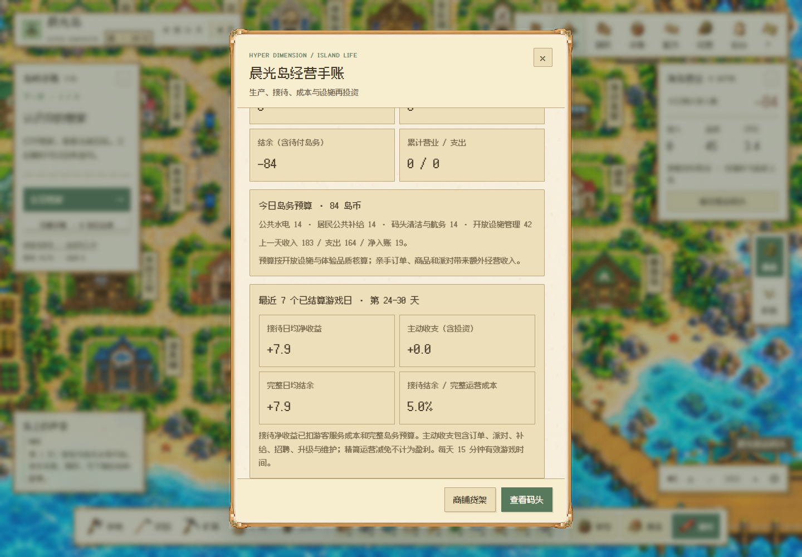
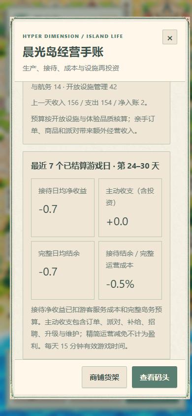

# V143 · 经营趋势与成熟小岛慢增长

2026-10-09。两种画风共用同一经济规则与存档。

## 经营目标

成熟小岛允许日均小幅挂机盈利。基础经营和启动阶段允许有波动；玩家采集、制作、履约与承办活动带来额外收益。每个游戏日为 900 秒有效游戏时间，离线时间不结算收入或岛务。

本轮保留现有 V105 报价、预算与消费规则，补齐实际收支展示和长期回归。升级最高四级，品质上限 95；渡船每 90 秒两名候选旅人，岛上最多六名自动游客；个人订单每天三项、每项一次，活动共享当日额度。服务成本、岛务、工具物资、升级维护、活动材料和招聘工资构成消耗。

## 看懂经营手账

「经营」入口新增最近最多七个**已经结算**游戏日的报告：

- 接待日均净收益 = 游客收入 − 游客服务成本 − 完整岛务预算。
- 主动收支（含投资） = 完整净结余 − 接待净收益；包含订单、派对、补给、招聘、升级和维护。
- 完整日均结余按全部实际收支和完整预算核算。
- 接待结余／完整运营成本帮助判断收入增速；精简运营减免不计入盈利。

未完成首日时显示等待实际记录。当前一天尚未结算的收入不作为日均盈利预测。已有预算／实付历史即使缺少旧 `deferred` 字段，也从差额核对减免。报表不改钱包、库存、历史回执或报价。





## 60 日模拟结果

下表为第 6–60 游戏日平均**完整运营净额**，单日仍有波动。「成熟」模拟的初态为最高四级、95 品质，不包含此前升级过程或投入回收。

| 状态 | 像素：岛币／日 | 折纸：岛币／日 |
|---|---:|---:|
| 普通经营挂机 | +4.45 | +3.38 |
| 普通经营，每日一项手作订单 | +14.49 | +14.73 |
| 成熟经营挂机 | +9.98 | +8.40 |
| 成熟经营，每日一项手作订单 | +19.98 | +18.89 |
| 零币零库存开局挂机 | +4.80 | +5.16 |
| 零币零库存开局，每日一项手作订单 | +13.31 | +13.20 |

成熟挂机平均盈余为完整成本的约 4.4%–5.2%；后 15 日较前 15 日的日均净额增量分别约 +1.33、+5.53 币。当前矩阵未显示快速复利增长。

回归范围：挂机平均净额 −10 至 +12／日、收入不超过完整运营成本的 108%；每日一项订单平均净额 +2 至 +26／日、收入不超过完整成本的 120%；成熟场景前后时段日均净额增量最多 +8。它们是此矩阵的验证门槛，单日波动需要结合实际趋势查看。

## 验证与复现

[完整模拟数据](verification/v143/economy-900s.json) · [脱敏检查摘要](verification/v143/verification.json)

模拟使用真实 NPC 工作／生活、作物成长、游客交易、寻路与日结规则；时间加速到 0.2 秒步长，模型接口屏蔽。玩家采集、递归制作和一项日订单由脚本产生，最高升级初态也为合成。依赖材料先预留，防止后做的组件消耗前面已经备齐的输入；日结逐笔累加核对现金守恒。

Windows PowerShell：

```powershell
$env:HD_ECON_DAYS='60'
$env:HD_ECON_QA_DIR='qa/economy-current'
node tests/v26-economy-simulation.mjs
node --test tests/v143-economy-trend.test.mjs
node tests/v143-economy-browser.mjs
```

macOS shell：

```sh
HD_ECON_DAYS=60 HD_ECON_QA_DIR=qa/economy-current node tests/v26-economy-simulation.mjs
node --test tests/v143-economy-trend.test.mjs
node tests/v143-economy-browser.mjs
```

UI 检查以隔离存档预载上述模拟历史，使用原生 Edge／Chrome；桌面、390px、关闭重开与刷新通过。它验证显示和恢复。完整五活动、招聘工资、升级回本、专精与真人制作时间的组合经济继续在原验收范围内。原不可变 V142 双画风真实一小时已完成，[数据与范围](frozen-hour-v142.md)单独记录；不能据此标记 V143 或全产品长测完成。

## English

Mature islands may earn a modest passive surplus. The cash policy remains V105. A new ledger report uses up to seven settled game days and separates visitor operating surplus from active receipts and investment. Full operating costs include relief amounts, so reduced bills are not counted as earned profit.

The dual-style 12-case, 60-game-day synthetic matrix records mature passive net income of about 8.4–10 coins per 15-minute game day, and about 18.9–20 with one daily craft order. Normal NPC/visitor/farming/path/time rules run with blocked model endpoints and accelerated time. Player inputs and maximum-upgrade starting states are synthetic. Full activity/recruitment/investment/human acceptance remains open. Native desktop/390px history display, close/reopen and refresh checks pass in both art styles.
