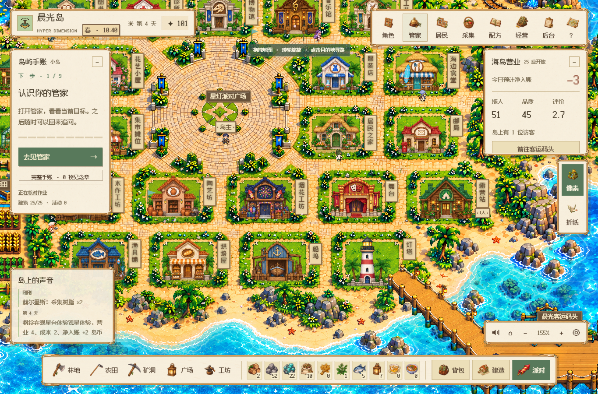

# V142 · 不可变交付包真实一小时复核

2026-10-09。交付包源码提交 21f4f430833417a117532f42094e9e3532ac868e；1569 个载荷文件运行前后 SHA256 保持一致。独立离线重建本包 Python3.11/Hermes0.19 环境后，在 AMD5600／32GB／RTX5060 Windows 目标机同时运行两套原生 Edge。

两版从零币零库存开始，正常时钟连续可见运行各60分钟，无时钟或物资注入；空浏览器重开保留三笔完整日结、钱包和来客记录。自动模型300/600/950秒节奏不变，取得实际 deepseek-flash 和 Hermes 工具响应。

| 指标 | 像素 | 折纸 |
|---|---:|---:|
| 实际观察秒数 | 3603.84 | 3600.47 |
| 平均帧率 | 164.29 | 164.13 |
| 帧时P95（直方图上界） | 6.25ms | 6.25ms |
| 最长单帧 | 115.10ms | 230.30ms |
| 长任务数量 | 1 | 3 |
| 寻路P95（305次） | 3.30ms | 3.20ms |
| 页面／素材错误 | 0／0 | 0／0 |
| 已验证DeepSeek／Hermes回复 | 17／3 | 18／4 |
| 空浏览器恢复 | 通过 | 通过 |

像素两次接口429是自动更新间隔尚差1秒的 `automatic_cooldown`，被现有低频处理保留原安排；折纸没有API错误。实际完整运营日净额像素 +4/−7/−3，折纸 −1/−21/+15，均属于初始零资源经营，不作为成熟长线经济结论。钱包保护的精简减免不计为实际利润。

帧指标是实际自动化页面测量。存在单帧峰值；同时运行其他开发任务，并非独占性能测试。运行到第4天的部分日，不代表四个完整900秒游戏日。证明范围为不可变V142的正常被动生活／服务、模型和保存恢复；完整主动旅程、逐馆手感、实体Mac／多设备与真人测试分别验收。V143源码追加新的经营界面，需保留版本差异。

[脱敏数据](verification/v142-hour/verification.json)

## English

The immutable V142 release completes60 actual minutes in both native styles on the target Windows hardware. All1569 payload hashes remain unchanged before/after. An independently rebuilt offline runtime uses actual deepseek-flash and Hermes responses; zero-start wallets, three settled days and visitor records survive empty-browser reopen. Two expected one-second automatic cooldown responses occur in pixel. Frame spikes and concurrent developer load remain disclosed. This is automated passive acceptance of V142, not human feel, physical Mac/multiple devices, four full game days or V143/full-product acceptance.
