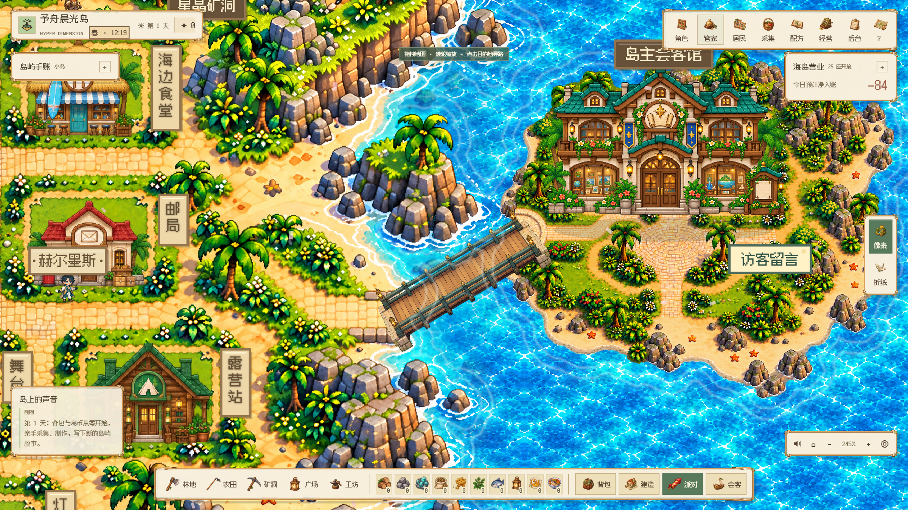
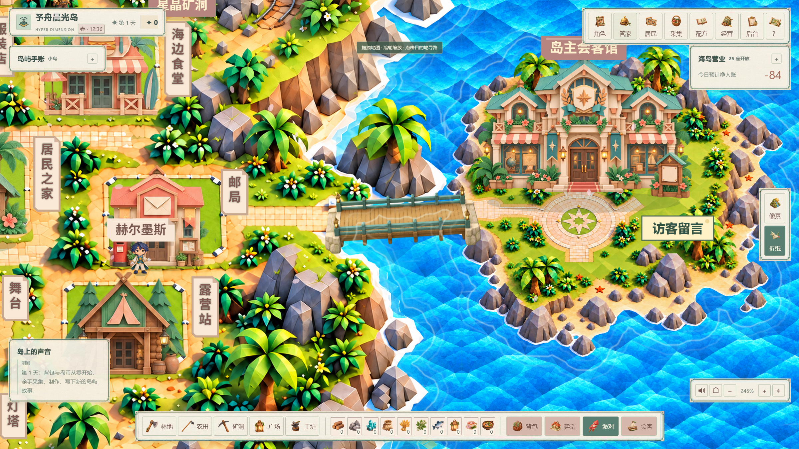
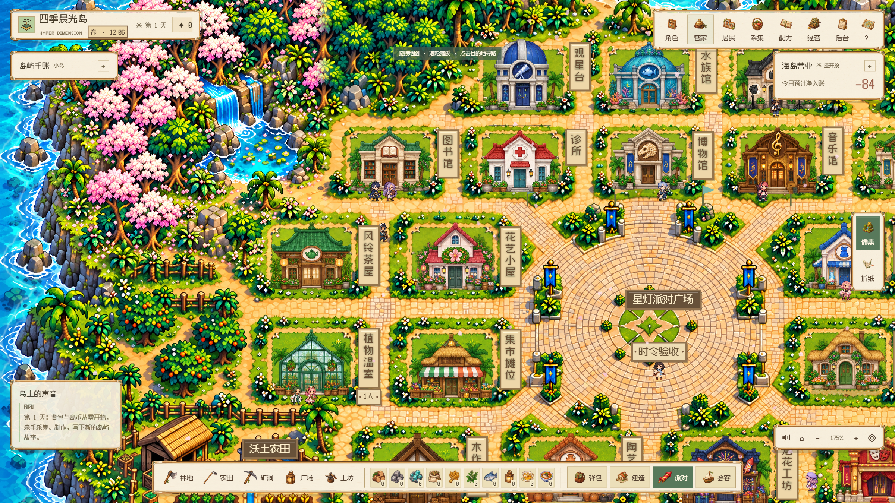
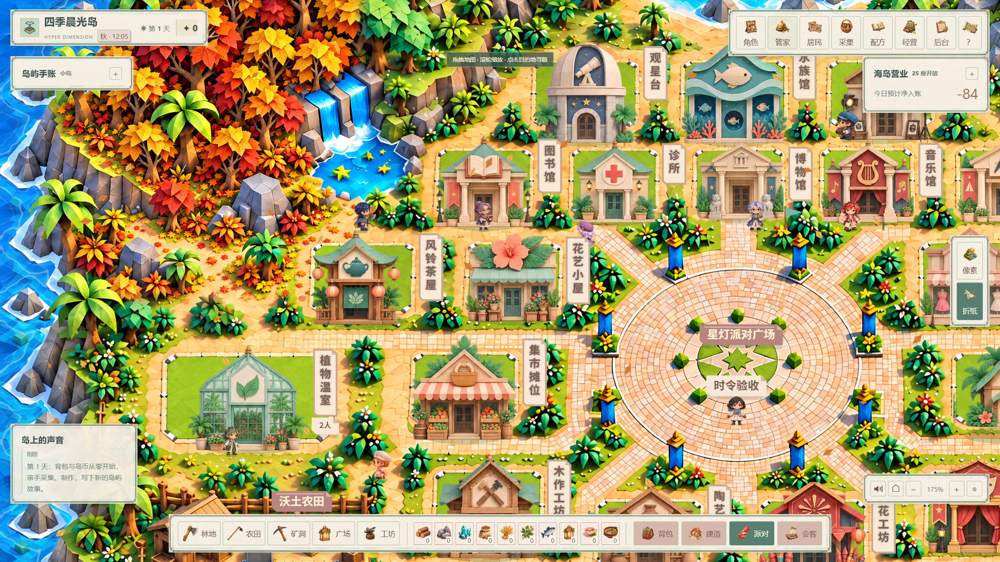
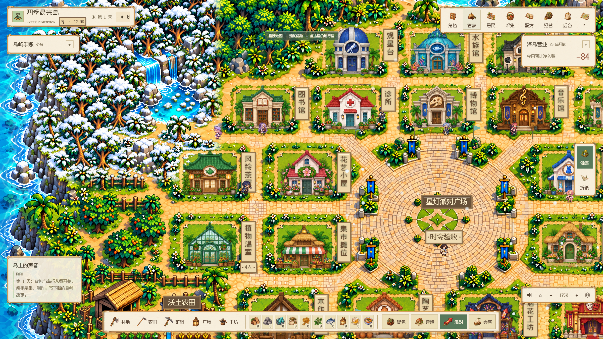
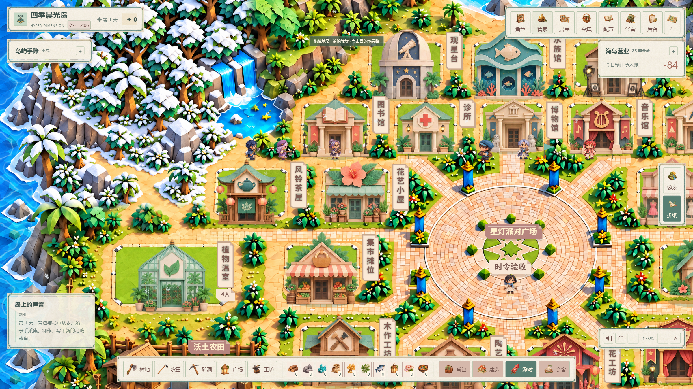

# V132 · 会客小岛与四季林地 / Gallery island and seasonal forest

## 中文

V131 的主岛拼接方案在用户实景复核中仍有痕迹，本版采用已授权的独立会客小岛与桥梁。主岛的 25 个生产地块保持原位；会客馆、庭院和留言板位于东侧小岛，两种画风各有与岸边落脚平台对应的桥梁。桥面参与寻路，桥旁海水不可通行；海浪在桥梁下方绘制。初始总览、高清分块和海岸遮罩使用一致的新地形。

春、秋、冬的北部林地各有一套新绘制的高清素材：樱花树冠与地面花瓣、金黄／橙红林木与落叶、树冠／岩石积雪。夏季保留绿色原林地。花瓣会旋转飘动，落叶有叶脉与摆动，雪晶持续降落。当前季节地形覆盖北部林地，沿海棕榈与建筑屋顶保留原稿；四季并非全岛建筑重绘。昼夜光照仍连续变化。

六张季节森林原稿均为 1254 × 1254，保留原地块、瀑布、道路和建筑基址，采用现有地形分块权重接入。每次选中季节仅准备一次静态素材，按 32 行让出主线程，帧循环不重新扫描图像。海面 Shader、共享时令与未来总服务器接口沿用 V131；900 秒有效经营日及无离线收益规则保持一致。

### 本轮验证

- 双画风会客馆真实页面：3 张附件、8 条经历、3 项项目、245% 桥梁近景，无页面错误；只使用隔离虚构账号。
- 领域寻路：主岛到展馆可达、确实经过桥梁、桥旁海水拒绝；已有档案与重复填充保护通过。
- 16 组昼夜／季节实景组合及 8 组森林近景通过；六组飘落素材在相隔 0.8 秒的绘制结果中均有实际移动。
- 原生 Windows GPU 检查中，双画风各 360 帧的 p95 约 6.2 ms，无超过 50 ms 的帧；此结果来自本机隔离测试。
- V131 修复后的三平台 GitHub 部署检查均通过：[实际运行](https://github.com/MkaliezZ/hyper-dimension/actions/runs/37793155562)。V132 的发布 CI 以新提交结果为准。

完整产品、实体 Mac、真人、多设备及新版宣传视频验收继续按原待办执行。旧视频标注其 V108 录制版本；本文件不是整体签收记录。

## English

The V131 stitched extension still showed seams in the user's visual review. V132 uses the authorized separate gallery island and bridge. All 25 production parcels stay fixed. Each appearance has a bridge aligned to its mainland and island landings; routes cross the deck and adjacent seawater is blocked. Ocean animation is rendered beneath the bridge. Overview, detailed tiles and coast masks share the updated terrain.

Spring, autumn and winter each have an original high-resolution northern forest painting: blossom canopies and petals, golden/red foliage and fallen leaves, or snow on trees and rocks. Summer retains the original green forest. Rotating petals, fluttering veined leaves and falling snow crystals provide motion. Seasonal terrain currently covers the northern forest; coastal palms and building roofs retain their original art. This is not a complete seasonal repaint of every island building.

All six seasonal forest originals are 1254 × 1254. Geometry, paths, waterfall and building sites remain aligned. A selected season is prepared once in asynchronous 32-row chunks; no image scan occurs in the frame loop. The V131 ocean shader and shared central-clock interface remain available. Visual time stays separate from the 900-second effective economic day and offline income remains disabled.

Native Windows checks cover both gallery appearances, bridge close-ups, persistent fictional images, eight milestones and three projects; 16 day/night-season combinations; eight forest close-ups; and measured falling-animation changes. Existing-profile protection and bridge-constrained routing pass. GPU frame checks measured about 6.2 ms p95 over 360 frames per appearance, without a frame over 50 ms. V131's corrected Windows/Intel/ARM GitHub checks all passed; V132 CI is recorded for its own commit. These checks do not constitute full-product, physical-Mac or human acceptance. The refreshed showcase video remains a separate open item.

## 实景 / Native captures

| 像素会客小岛 / Pixel gallery island | 折纸会客小岛 / Origami gallery island |
| --- | --- |
|  |  |

| 樱花 / Blossoms | 秋林 / Autumn |
| --- | --- |
|  |  |

| 像素积雪 / Pixel snow | 折纸积雪 / Origami snow |
| --- | --- |
|  |  |
