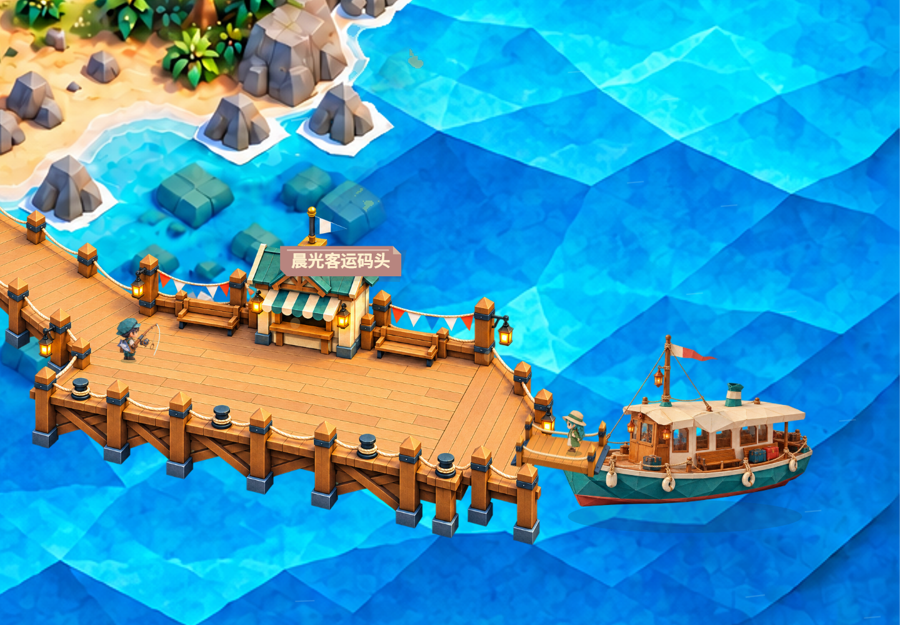
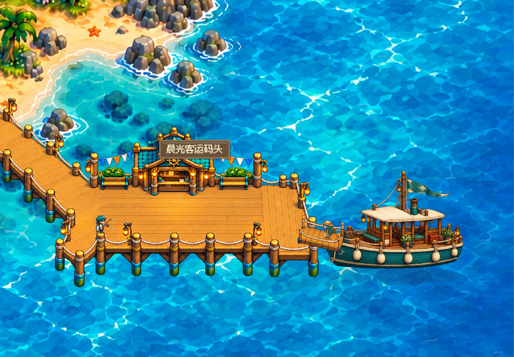

# V109 · Ferry boarding artwork

## Changes / 本次修改

- Replace the flat procedural gangway with separate pixel and origami timber-and-rope artwork matched to the existing pier.
- Calibrate the sprite by its two deck thresholds, overlap the end shoes onto the pier and ship, and move only the ship end with a restrained mooring bob.
- Draw the near handrail after passengers, so characters remain between the two rails.
- Correct the boat sprite's visual anchor to clear the pier; trim the first atlas row to exclude the next boat's mast tip.
- Preserve all logical passenger routes, queues, timing, save coordinates and economic rules.

## Verification / 验证

Both themes completed a native first-ferry arrival from isolated zero-state saves, at normal game speed, with the actual visitor passing over the new gangway and the server accepting landing. No time, inventory, position or quality injection; model calls disabled for this art check. Existing continuous transfer/full-queue/boarding and boat-motion regressions, plus the new fixed-shore/floating-ship anchor checks, passed locally. This is a focused harbor verification, not complete game or physical-Mac acceptance.

## Artwork provenance / 美术来源

Generated with the built-in imagegen tool, using existing project-owned dock and boat sprites as style references. Transparent PNG outputs were copied unchanged into the project; depth clipping and perspective alignment are performed by the renderer.

- `public/assets/gangway-origami-v109.png`
- `public/assets/gangway-pixel-v109.png`

### Origami generation prompt

Use case: stylized-concept. Asset type: a single transparent 2D game sprite, replacement passenger boarding gangway for a cozy origami island ferry. Reference image 1 is the existing origami timber pier; reference image 2 is the existing teal ferry. Match their warm folded paper / faceted papercraft craftsmanship, ivory rope, honey-gold timber, restrained navy metal brackets and warm upper-left lighting. Create ONLY a SHORT LOW passenger gangway, no pier, no ferry, no people, no ocean, no floor or opaque background. Elevated front view aligned horizontally left-to-right, long walking axis slopes gently DOWN toward the right (about 1 in 6). The two OPEN END thresholds are at the left and right. Deck is about twice as long as it is wide in projected view, shallow oblique parallelogram, absolutely NOT a ladder or a vertical drawbridge. Clear thick wooden deck made of 7 transverse non-slip planks, fine folded edges and a slim visible front fascia. Exactly 4 modest wooden posts, one at each corner, with a continuous cream rope along each of the TWO LONG SIDES only. Left and right entrances completely unobstructed. No middle posts, no rope crossing either entrance. Far handrail visible behind walking deck, near handrail visible in front. Small navy hinged metal end shoes flush to both open ends; no tall supports or legs. Long deck centerline left threshold at about (180,530), right threshold at about (1120,680) on a 1280x1024 canvas, leave transparent generous margin above and below. Full object in frame, crisp clean alpha, no lettering, no markings, no cast shadow beyond the object. Render as a polished production sprite matching the references, not a flat diagram.

### Pixel generation prompt

Use case: stylized-concept. Asset type: a single transparent 2D pixel game sprite, replacement passenger boarding gangway for a cozy island ferry. Reference 1 is the existing PIXEL timber pier, reference 2 the PIXEL teal ferry: closely match their finely crafted pixel-art wood, square crisp pixels, warm honey-gold palette, cream rope and restrained navy metal fittings. Create ONLY a SHORT LOW passenger gangway, no pier, no ferry, no people, no ocean, no floor or opaque background. Elevated front view, long walking axis from LEFT to RIGHT, slopes gently DOWN to the right, about 1 in 6. A shallow horizontal oblique parallelogram deck, about twice as long as its projected depth. NOT a ladder or a vertical drawbridge. Exactly 7 crosswise wooden deck planks, slim thick front wooden fascia with shaded pixel clusters. Exactly FOUR modest posts, one at each corner, TWO cream rope rails joining the posts on the LONG sides only. Both left and right entrances completely open, no bar or rope across either threshold. Far rail behind deck, near rail in front. Flush small navy metal hinge shoes at the two ends, no legs below. Full object fits comfortably inside a 1280x1024 transparent canvas; deck centerline left threshold around (180,530), right threshold around (1120,680); all object bounds clear of canvas edges. Make this look like a high-quality matching production pixel asset, not a vector icon or low-detail placeholder. No text, no labels, no extraneous cast shadow or background, actual alpha transparency.
