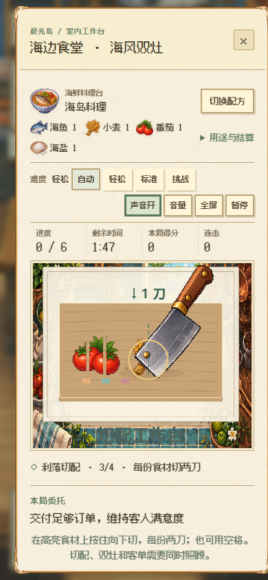
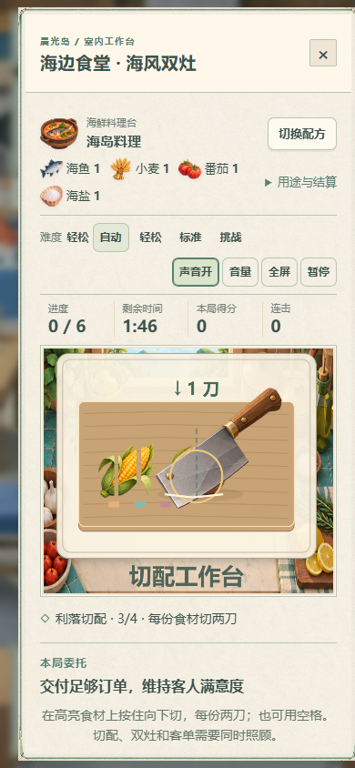

# V142 双灶空间切配 / Spatial kitchen preparation

## 操作变化

- 在客单对应的食材上，从上方向下划刀。每份食材切两刀，刃口与实际食材位置对应；食材随进度分为切段。
- 刀路越接近切口中心，切配品质越高，并与装盘火候一起影响成品评级。操作失误仍可重试，不会把关卡锁死。
- 空格或“切一刀”支持键盘及按钮操作；落刀后有 0.36 秒恢复时间，瞬间连续点击不能完成全部切配。
- 保留双灶排程、随机客单和三档难度。移动端单独聚焦切配台，下方继续使用双灶和客单操作。
- 新厨房正常检查点采用连续保存。确认结算前需同步完全部动作；真正的网络错误仍保留重试。
- 不以最少渲染帧数判断划刀，快速触摸不会因为窗口刚缩放而被误拒绝。

## 存档与经济

新厨房关卡采用 `schemaVersion: 142`，服务端使用相同空间判定、冷却和品质计算回放实际输入。旧关卡没有此版本号，继续原切配规则，保持旧动作日志和在途任务兼容。材料预留、配方、费用及成品数量均沿用现有制作事务。

## 已取得的证据

两种画风在隔离小岛的海边食堂完成：实际走入建筑 → 鼠标切两刀 → 磁盘保存并刷新恢复同一作业 → 390px 手机触摸切配 → 空格处理其余客单 → 按正常时间守双灶 → 一次性领取海岛料理 → 再次刷新核对同一结算记录。

这项测试使用提前解锁的虚构岛屿和基础素材，各模型端点关闭。它验证输入、制作、持久化和结算，不替代真人体验、真实 AI 互动或全局经济长期验收。

[结构化验收](kitchen-v142-verification.json)

| 像素 / Pixel | 折纸 / Origami |
| --- | --- |
|  |  |

## English

Slice down through each highlighted ingredient twice. A blade crossing near the center earns better preparation quality, which combines with cooking and serving precision. Ingredient artwork separates into actual pieces. Space or the cut button remains available, with a 0.36-second knife recovery period.

Two stoves, seeded random orders and three difficulty levels remain. Mobile view focuses on the cutting board while retaining order/stove controls. New kitchen checkpoints stream inputs during normal saving; claiming waits for all input batches. Quick touch gestures do not require a minimum number of rendered frames.

Version 142 rules are shared by the browser and authoritative server replay. Older saved kitchen levels retain their original cutting rules. Stock reservations, recipe costs and one-item settlement remain unchanged.

Both styles completed a normal-clock kitchen using native mouse, mobile touch and keyboard, restored the same task from disk mid-game, and reopened one exact recipe receipt. This uses isolated fictional stocked/unlocked islands with model calls disabled; human gameplay, real providers and long-term economy require separate evidence.
