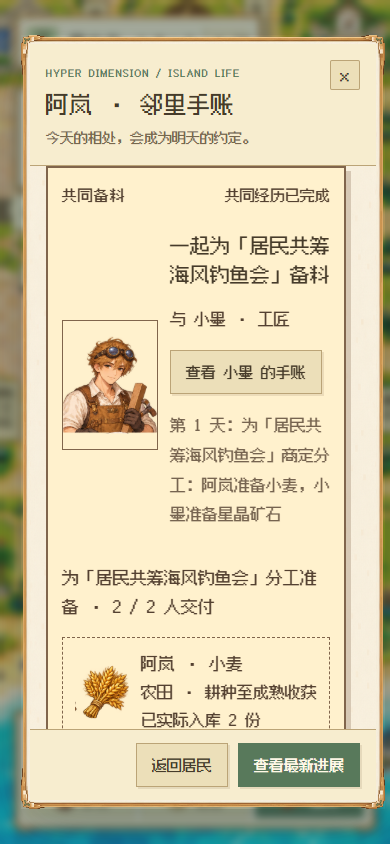

# V111 · 居民协作与活动备料 / Resident cooperation

## 本次改动

- 已发布活动的场地耗材、留用装备和未交邀请赠物进入实际缺料计算；已预留库存不能再被消费。
- 两位居民按职业分别承担一个真实生产步骤，可能是后续配方的原料，不把一次分工描述成整场活动已经筹备完成。已有管家筹备项目保持其调度权。
- 自主约谈使用具体分工，邻里手账分别显示伙伴、物品、地点和实际交付。浏览器生成的约定编号、物品及活动名称保留在模型输入中。
- 采集、制作、采矿、耕种都经过原有服务器作业接口。服务端核对参与者、约定、动作编号、物品及配方；只以实际生产回执记入贡献。
- 松土、播种、浇水与分段开采属于准备步骤；只有目标物资实际入库才算交付。合作田垄保留到收获，普通居民不能改种；岛主可主动接手。
- 活动修改、取消、物资备齐或交给管家时收尾，已交付物资保留。已开始的真实作业先确认结果，不虚构补偿或重复交付。
- 修复像素寻路终点取整造成的到场误判，以及合作重试读取错误日计时字段的问题。缺料收尾检查每秒一次；模型频率继续使用既有 300 / 600 / 950 秒政策。

## Verification scope

Both pixel and origami native runs completed actual autonomous conversations, distinct-item cooperation and a farm harvest, with server receipts. The 390px journal and decoded portraits were inspected in both themes. 89 related rules passed, including 16 new cooperation checks. The default suite initially passed 678/679 tests; the one failure was a Windows nested-deployment fixture missing its two served source files when another relative-path server was running. The fixture now includes those files, retains every original assertion, and all 13 scope tests pass. The focused suite covers occupation fit, reservation-aware demand, actual per-person receipts, farming stages, crop ownership/player takeover, normal economic time, conversation fallback and physical meeting endpoints. Existing farm, field, resident and migration tests are also being run. Native dual-theme browser verification uses a published-event fixture with three seeds, normal game time and local fallback conversations; provider endpoints are blocked. No conversations, movement, plot stages, harvest results or game clock are injected. Full product acceptance remains incomplete.

## Compatibility

Legacy episodes with a single `plan` remain readable; new episodes may additionally contain `plans`, an activity `demand`, and cooperative farming `workSites`. Client and backend must be deployed together. Back up existing data before restarting the runtime; preserve the user's saves and configuration.

运行规则测试：`npm run test:resident-cooperation`。原生双画风检查：`npm run test:resident-cooperation-browser`（需要本机 Chrome / Edge / Chromium，允许通过 `HD_QA_BROWSER` 指定绝对路径）。

