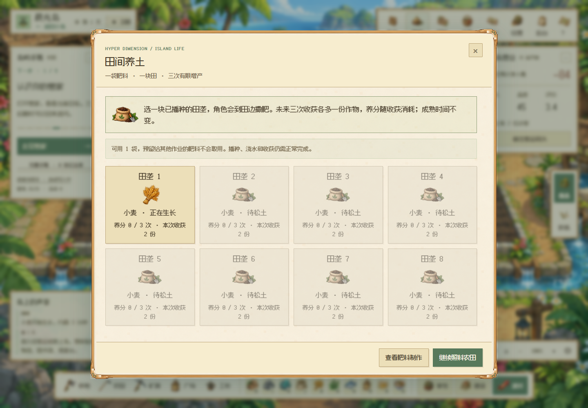
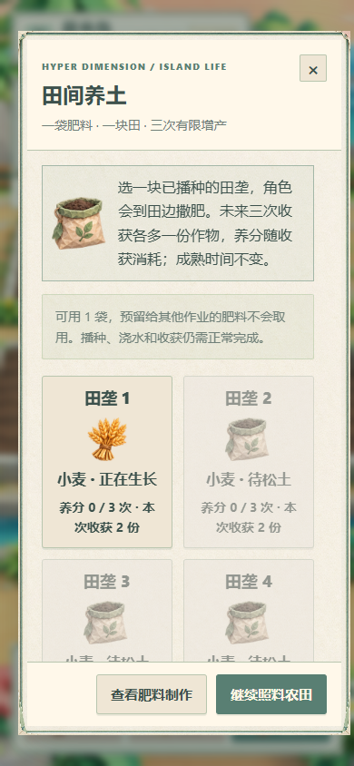

# V159 · 制成肥料，然后真正用在田里

## 温室 → 农田 → 有限增产

温室肥料 `c14_8` 由原配方和温室小游戏实际制作。背包的“前往农田施肥”打开养土面板；农田也有独立入口。选择已播种、未成熟且没有剩余养分的田垄，角色到田边用对应画风的肥料袋撒肥。动作持续 2.5 秒，带有落下的肥料颗粒。

一袋肥料只用于一块田，提供三次收获，每次多一份作物。收获减少一次养分，第四次恢复原产量。11 种作物保持原有 180–480 秒的成熟时间，不可叠加施肥；尚有养分或已成熟的田不能重复施肥。

开始作业先预留一袋，完成后才消费；取消归还，断网、重试和刷新不会重复消费或增产。居民收获会消耗同一块田的养分，不能记为玩家亲自收集。用户未经确认的存档请求不能更改服务器养分记录。

## 默认货架保留首件

旧版自动陈列会把刚制成的肥料立即卖给游客。现在 300 种配方的自动货架对非食品保留一件，食品与非食品余量可出售。已有手动货架规则保持原值；用户可以明确把留用量改成零来出售首件，也可以提高留用量。该规则不预占制作、赠礼或派对所需的库存；已确认的游客交易仍按原合同完成。

## 页面与验证

养土页面采用相应画风的边框、图标和文字。桌面四列，390px 窄屏两列，关闭与返回按钮保持可达；打开弹窗时农田入口隐藏，不覆盖弹窗底部。入口只在主题或库存变化时重建图标。

- 九项新增规则检查覆盖限量增产、完整成熟时间、11种作物、取消返还、预留冲突、防伪、磁盘重开、默认货架及手动首件出售。
- [两套画风原生流程](verification/v159/native-soil-care.json)：实际温室推箱制作 → 松土 → 播种 → 浇水 → 施肥动画 → 等待约 186–187 秒 → 收获 3 份小麦和 1 份种子 → 刷新保留 2 次养分。未注入成品肥料或成熟作物。
- 为专门验证该流程，隔离存档提供配方原料、资金、种子与温室开放，小游戏输入参考本局合法解；模型请求关闭，首轮田地标记为玩家照料。不是零起点、真人或多设备验收。
- R09 其余制品的独特用途与动画、R14 多日综合经营仍在继续；本项不代表 300 制品已全部完善。小游戏继续属于占位演示，宣传录像仍为 V145。

| 像素养土面板 | 折纸窄屏 |
| --- | --- |
|  |  |

## English

Greenhouse compost is now a usable farm input. One crafted bag supplies three harvests with one additional crop each, without shortening any growth clock. Fertilizing uses the existing server lease, reservation and idempotent receipt flow; cancellation refunds the bag. NPC harvests spend the same nutrition without counting as player work.

Automatic shelves retain the first nonfood product and sell its surplus; food sales stay available. Explicit owner shelf settings override this default. Both native themes passed actual crafting, farming, fertilizer animation, full 180-second wheat growth, harvest and refresh with isolated granted-input fixtures. This is partial product-use progress, not full-game, human or physical-device acceptance.
