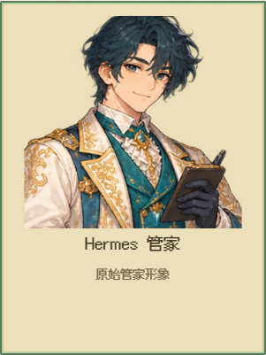
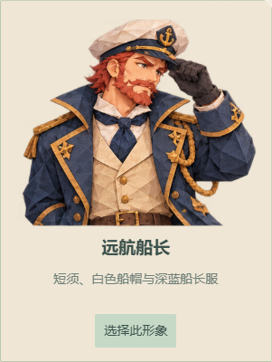

# V153 · 管家与角色立绘裁切

默认管家原先用 4 × 4 的 CSS 背景定位，角色图集的实际行高不同，顶部会混入上一行。现使用居民立绘同一套明确源区域，在衣橱中保持完整、等比例显示。

12 套可选角色的两套半身立绘存在不规则排列：折纸船长左侧混入乐手衣袖，木作青年、学者、乐手、月白漫游者也有相邻图像碎片。现在按照原图透明间隔校准 24 个独立边界，以非矩形 SVG 裁切隔开邻近衣袖和头发；原 PNG、角色身份和八向行走贴图保持原样。此修复同时适用于岛主衣橱、管家衣橱和其他共用半身立绘的位置。

## 实际页面检查

[双画风原生记录](verification/v153/native-portraits.json) 使用隔离账户和存档，禁止模型请求。每套画风 13 个管家选项均经过实际选择和服务端确认；代表女性形象刷新后仍显示为已选择，存档身份一致。390px 和 768px 宽度无横向溢出。两套共 26 张不同立绘均由开发代理逐张检查截图，未替代真人验收。

六处已知邻图位置在原生截图中的背景差异原为 37–171 RGB；修复后均为 0，检查容差仍为 3 RGB。像素默认管家的顶部串图也已消除。测试首次因默认图使用内外两层 SVG 而未能唯一定位视口，第二次因 CSS 悬停亮度使截图颜色不同于原始 CSS 值而失败；现明确选外层 SVG，并从同一张截图读取背景，保留失败记录。

| 像素默认管家 | 折纸远航船长 |
| --- | --- |
|  |  |

## 版本与边界

V152 部署包已经公开，其运动修复与三平台结果保留。V153 增加本次立绘修复，本提交的部署、原生和跨平台结果分别记录。V152 的实际一小时仍作为 V152 独立证据，不冒称 V153 一小时完成。小游戏仍为占位演示；本项不代表全部素材、动画、真人体验或完整验收已完成。
