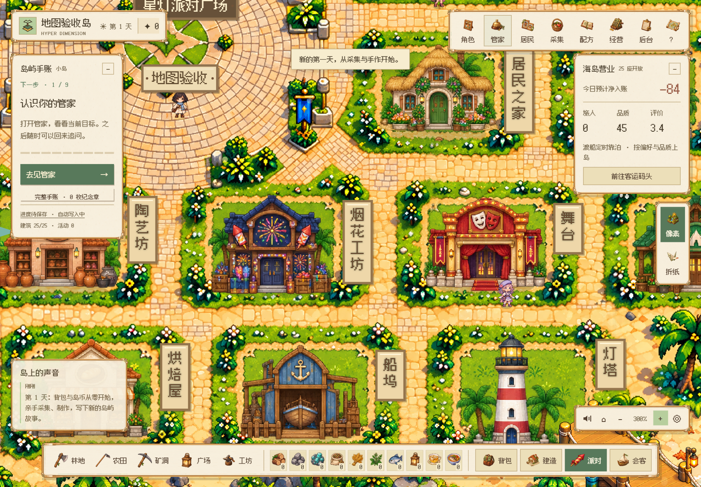
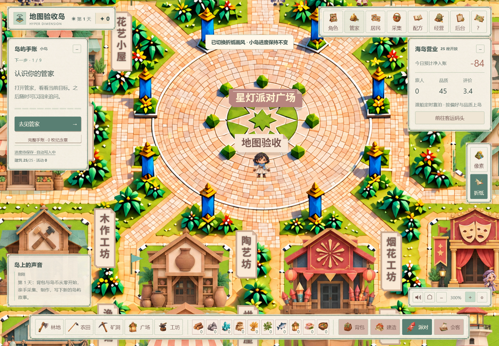
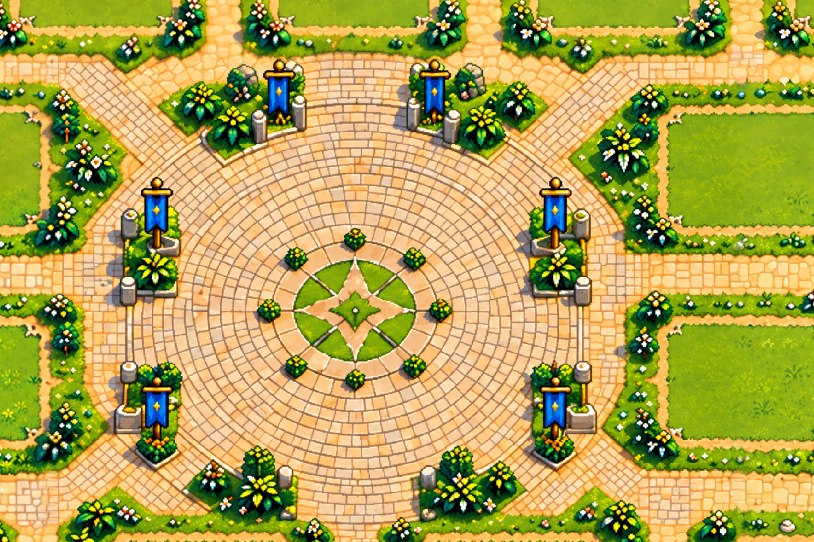
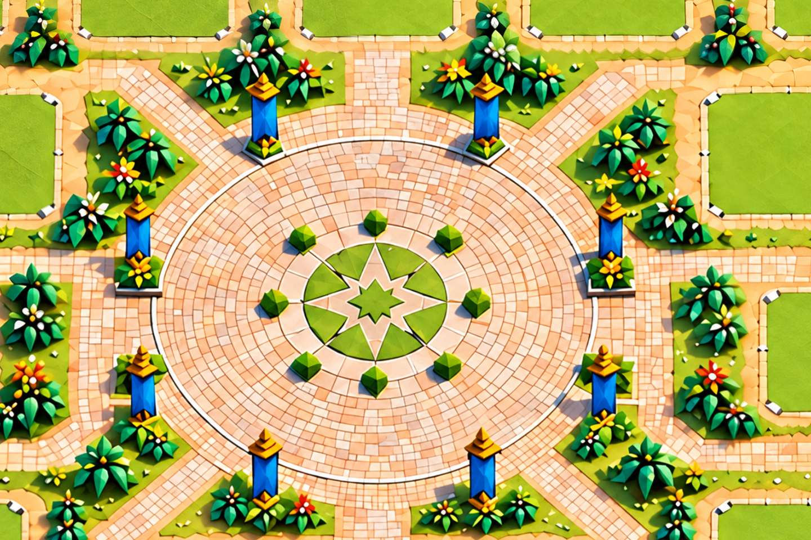

# V119 · 分块底图与缩放 / Tiled terrain and zoom

## 已接入的内容

像素与折纸各有 **12 块独立重绘地形 + 1 块完整广场**，共 26 张新图。不是将旧底图放大后切片。每块覆盖约 384 个世界单位，实际图像约 1208–1565 像素宽；广场采用完整地标图，避免圆形铺砖跨块时出现重影。精确尺寸、文件哈希见 [素材清单](terrain-art-v119.json)。

- 地图坐标保持 1536 × 1024，25 个建筑地块、道路、海岸、交互位置使用原有坐标。
- 当绘制密度高于 1.12 个物理像素／世界单位时，按当前视野加载高细节分块；总览及失败回退保留旧图。
- 两个并发加载，工作线程解码和预处理；最多 128 MiB 地形位图缓存。切换画风释放上一套位图。
- 重叠区使用互补权重，在独立透明层中合成；画面静止时复用结果，不逐帧读像素或重建地形。
- 资源失败时保留对应低清预览，不让地面出现空洞。浏览器不支持相关工作线程能力时使用总览底图。
- 同步加入双画风独立锄头素材，校准八向动作的手握点、落地位置和背身遮挡。

## 实际验证范围

Windows 原生 Edge，独立演示账号／存档：26 张资源完整加载；两画风的总览、300% 缩放、五处拖拽视野、画风切换、地块缺图回退；实际 /play 页面覆盖 25 座建筑及 16 位常驻角色的叠加显示。原有海岸处理、拼接权重及八向锄地几何检查通过。这里不代表 Mac 实机或完整产品验收。

| 像素：实际游戏页面 | 折纸：实际游戏页面 |
| --- | --- |
|  |  |

| 像素：地形渲染检查 | 折纸：地形渲染检查 |
| --- | --- |
|  |  |

下两图是独立地形渲染检查，未绘制建筑或人物；上两图是实际游戏页面。所有图片来自隔离环境，不包含真实用户资料。

## English

Both appearances now use **12 newly painted terrain tiles plus one complete plaza landmark each** (26 assets). These contain new detail rather than resized pieces of the old overview. The original world coordinates and gameplay anchors are retained.

Visible tiles load at higher physical pixel densities, using two concurrent jobs, worker decoding and a 128 MiB bitmap budget. Switching styles releases the previous style. Complementary overlap weights are composed in a separate layer, cached while the camera is stationary. Missing tiles and unsupported worker environments retain the overview fallback. The complete plaza preserves continuous circular paving.

Validation used native Edge on Windows with isolated saves: all assets, both styles, overview and 300% zoom, five pan regions, style switching, missing-tile fallback and actual game overlays. Both hoe assets and eight-direction contact geometry are also updated. This does not establish macOS hardware acceptance or full product acceptance. Minigames remain demonstrations under development.
