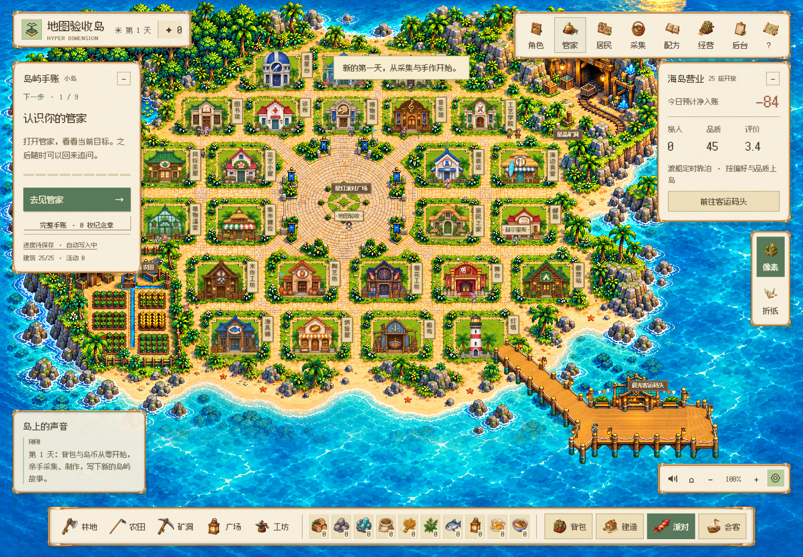
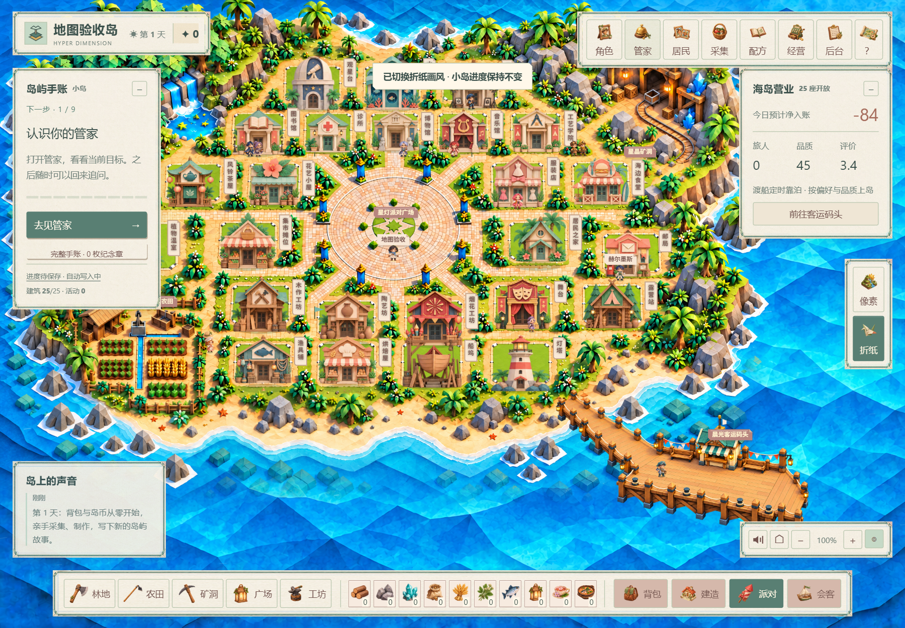
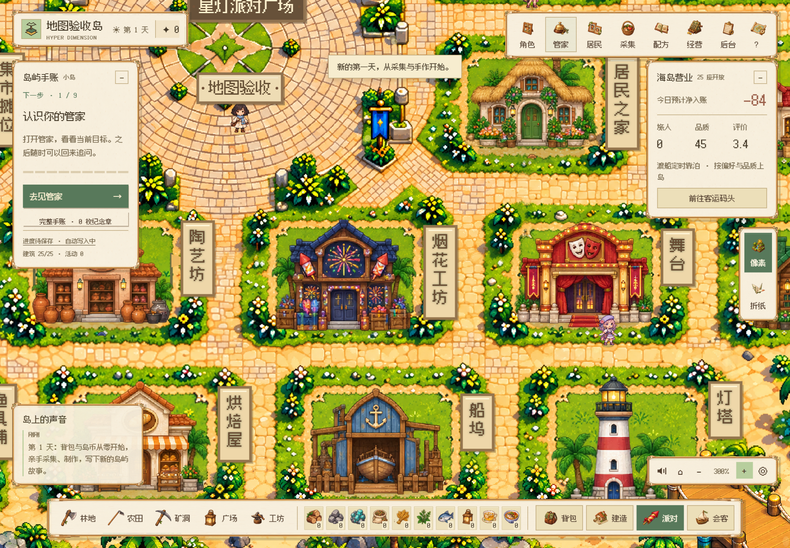
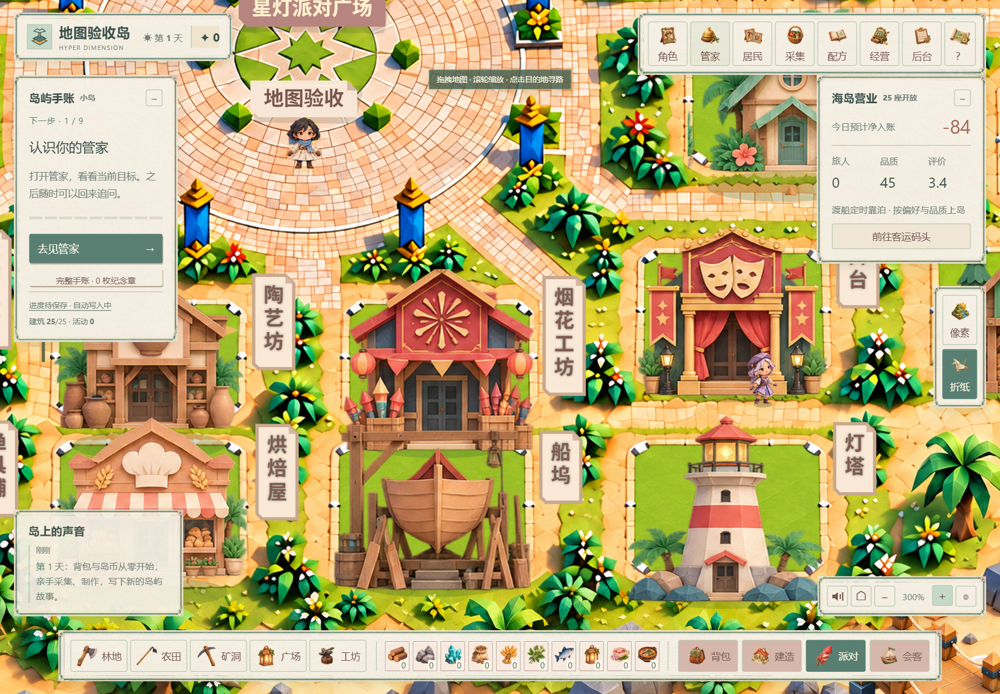

# V120 · 总览与缩放统一分块地形 / One painted terrain at every zoom

当前运行入口和预览已在 [V125](terrain-v125.md) 补齐。以下保留本版本当时的范围。

V119 已生成像素／折纸各 12 块重绘地形和 1 块完整广场，共 26 张素材，但默认总览仍受 1.12 倍物理绘制密度阈值影响，使用旧底图。V120 去掉该阈值：100% 总览与 300% 放大使用同一套新分块。

当前视野内的素材完整就绪后一起显示，避免加载中道路、广场出现新旧图混用。旧图仅在首次等待、资源失败或浏览器不支持工作线程时回退。工作线程解码、按视野请求、两个并发加载、128 MiB 位图缓存和静止画面复用继续保留；高细节图就绪后及时释放预览位图。

世界坐标、建筑位置与寻路数据未修改，双画风仍共用同一小岛存档。生成素材、精确尺寸和哈希见 [V119 原创素材清单](terrain-art-v119.json)。

## 实际验证

Windows 原生 Edge、隔离账号：两画风各 13 张完整就绪；100% 总览、300% 缩放、拖拽、五个区域、切换后释放旧画风、静止帧复用和缺图回退。实际游戏页面包含 25 座建筑及 16 位常驻角色。地形位图约 78 MiB，低于 128 MiB 上限；几何与海岸检查 7 项通过。该范围不代表 Mac 实机、真人或完整产品验收。

| 像素 · 100% 总览 | 折纸 · 100% 总览 |
| --- | --- |
|  |  |

| 像素 · 300% | 折纸 · 300% |
| --- | --- |
|  |  |

以上图片来自隔离游戏账号，不包含真实用户资料。

## English

V119 generated 26 original terrain/landmark assets, but a rendering-density threshold kept the old overview at small scales. V120 removes that threshold: the 100% overview and 300% close-up use the same newly painted tiles.

A visible viewport is revealed after its assets are complete, avoiding mixed old/new roads and plaza details during loading. The overview remains only an initial-loading, missing-resource or unsupported-worker fallback. Worker decoding, two concurrent jobs, viewport loading and a 128 MiB bitmap limit are retained. Low-resolution previews are released after successful high-resolution loading.

Native Edge checks used isolated game accounts for both appearances, 13 assets each, default overview, zoom, dragging, five regions, theme disposal, stationary-frame caching and missing-resource fallback. The actual game included 25 buildings and 16 permanent characters. Terrain bitmaps were approximately 78 MiB. Seven geometry/shoreline checks passed. This does not establish macOS hardware, human or full-product acceptance. Minigames remain development demonstrations.
