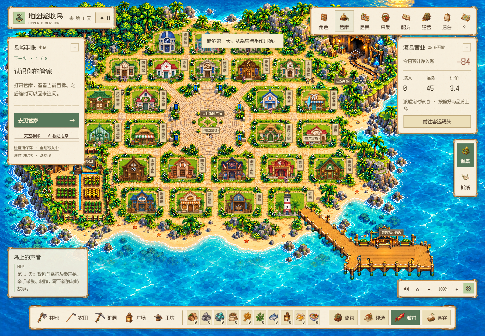
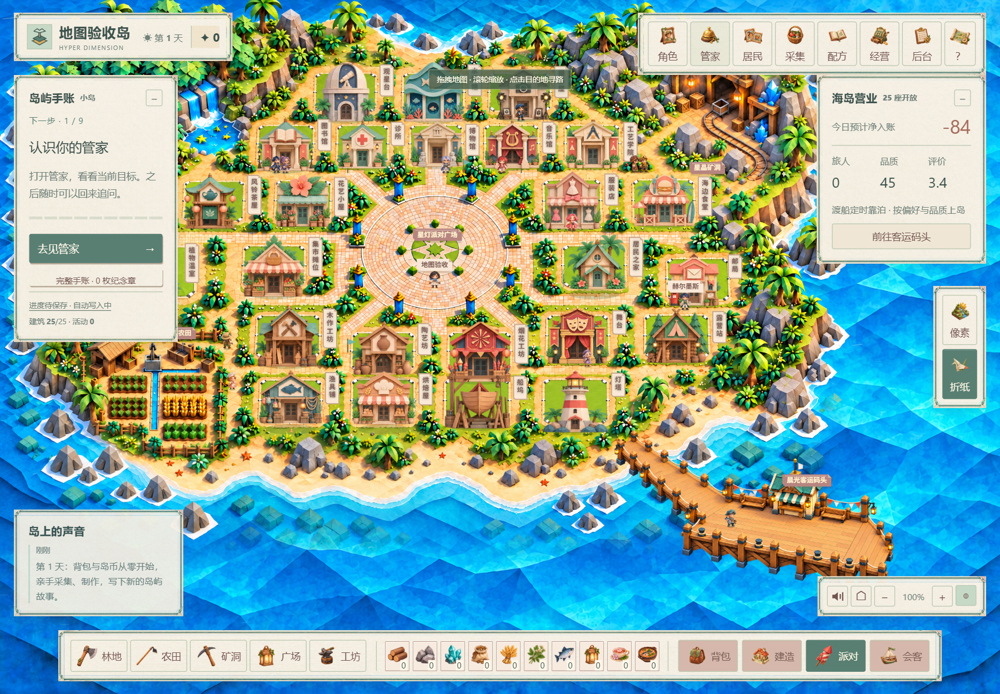
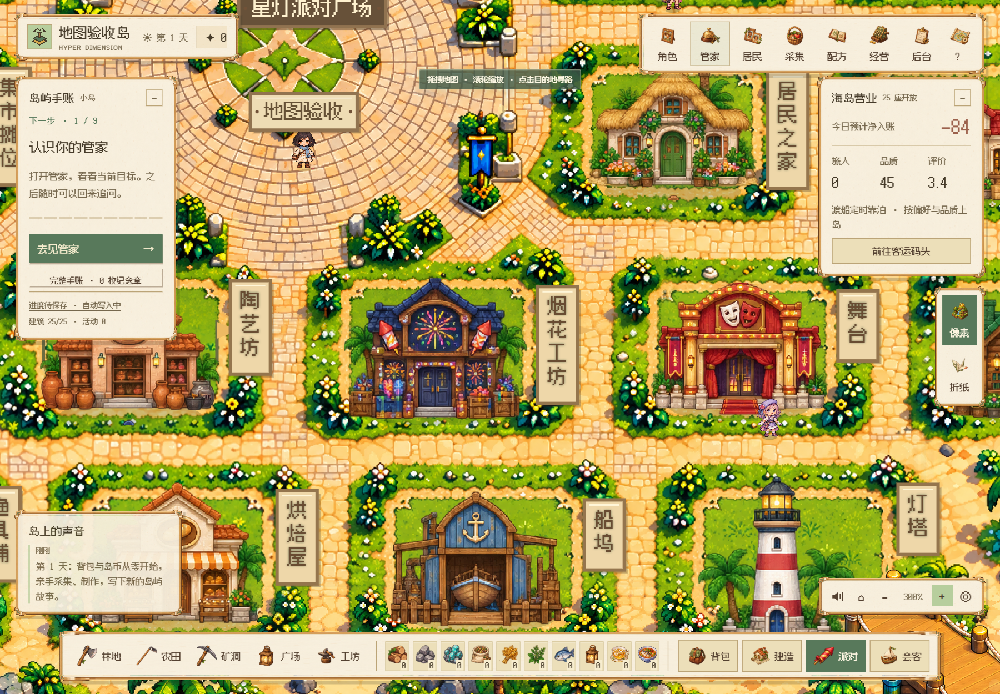
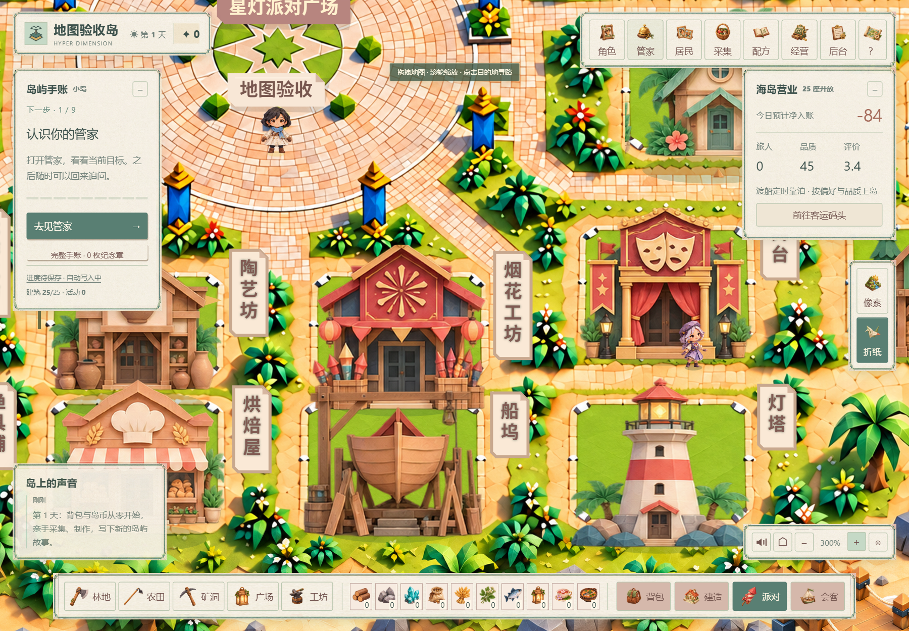

# V122 · 补齐高清分块加载 / Reliable tiled terrain

像素与折纸各 **12 块地形 + 1 块完整广场**，共 26 张原创高清素材。生成文件和哈希沿用 [素材清单](terrain-art-v119.json)。本次补齐加载兼容性，没有把旧整图放大作为新素材。

V120 在工作线程缺失、启动失败或超时后会一直退回旧整图。V122 保留工作线程优先加载，同时增加普通 Canvas 兼容路径：使用相同的高清分块和逐像素遮罩，每次处理 32 行再让出执行时间。没有 OffscreenCanvas 或 createImageBitmap 的环境也可加载新分块。切换画风会取消上一套未完成任务并释放位图。

临时失败最多尝试 3 次，间隔 1 秒和 4 秒；持续缺图只保留该块的旧预览。首次等待全部可见素材时仍显示原总览，资源齐备后一起显示。128 MiB 地形位图预算、两个并发加载、道路和广场交叠权重、静止画面复用继续保留。这里的预算指分块位图，不是浏览器进程总内存。

## 实际验证

Windows 原生 Edge、隔离存档：

- 8 项遮罩、世界覆盖、海岸、图片尺寸与缩放几何检查通过。
- 11 个兼容加载场景通过：两画风分别模拟 Worker、OffscreenCanvas、createImageBitmap 缺失，工作线程崩溃及一次 HTTP 503；另有加载中切换画风。
- 地形渲染器验证两画风全部 26 个素材、五处拖拽区域、总览、300% 缩放、缺图预览和静止画面复用。
- 实际 /play 页面分别在正常与兼容路径验证：25 座建筑、16 位常驻角色、两画风总览、300% 缩放与拖拽。每套地形位图约 78 MiB。

以下截图来自兼容加载下的隔离游戏账号，不含真实用户资料。以上不代表 macOS 实机或完整产品验收；小游戏仍为开发演示。

| 像素 · 总览 | 折纸 · 总览 |
| --- | --- |
|  |  |

| 像素 · 300% | 折纸 · 300% |
| --- | --- |
|  |  |

## English

Both appearances have 12 original high-resolution terrain tiles and one complete plaza each (26 assets). V122 completes loading compatibility using the existing painted assets, rather than enlarging the old overview.

A failed or unavailable worker now switches to a regular Canvas loader using the same tile masks in 32-row tasks. It also supports missing OffscreenCanvas or createImageBitmap. Theme changes cancel old jobs and release surfaces. Transient failures have three attempts with 1- and 4-second retry delays; a persistently missing tile keeps its own overview preview. Initial loading retains the overview until the visible tiles are complete. Two concurrent jobs, cached composition and a 128 MiB tile-bitmap budget remain.

Validation used native Edge on Windows with isolated saves: eight geometry/mask checks; eleven injected compatibility/failure cases; both appearances at overview and 300%, five pan regions, missing-tile fallback; and the actual play page with 25 buildings and 16 characters on both the worker and compatible paths. Screenshots use isolated accounts. This is not macOS hardware or full-product acceptance. Minigames remain development demonstrations.
