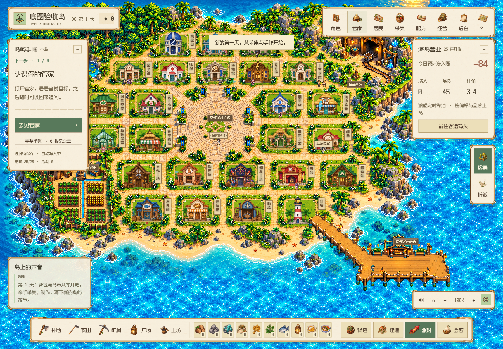
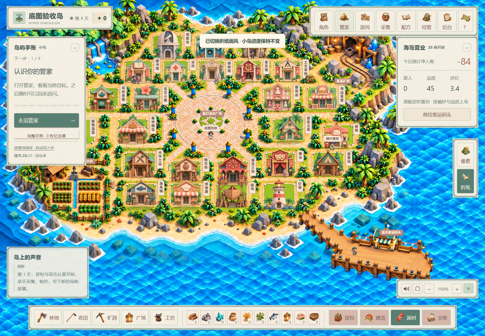
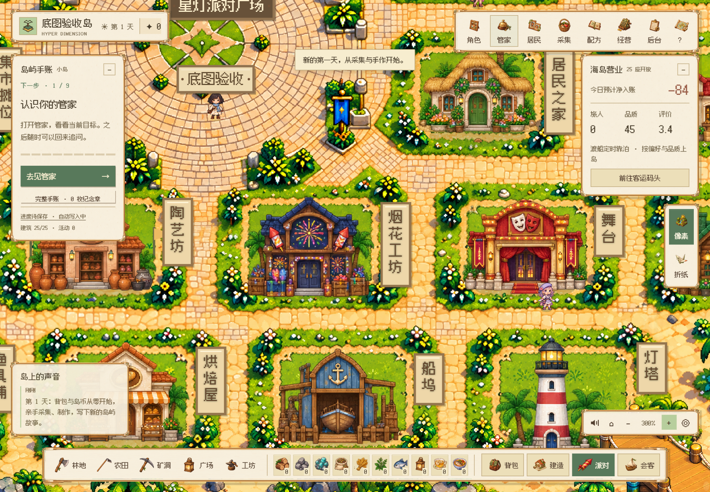
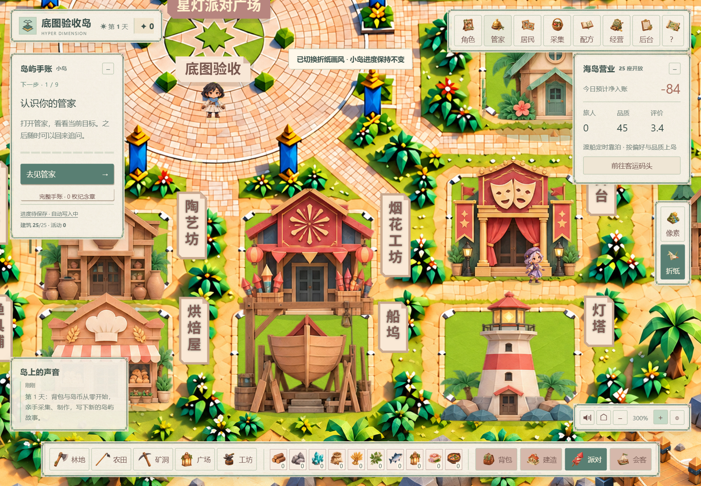

# V125 · 分块底图收尾 / Complete terrain integration

像素和折纸各有 **12 张原创高清地形块、1 张完整广场、1 张高清海面**。本次新增各 1 张由这些分块实际合成的 1536 × 1024 总览预览，共 30 个地形相关文件。高清原图清单见 [地形来源](terrain-art-v119.json)、[海面来源](sea-art-v122.json)；派生预览的尺寸和哈希见 [预览清单](terrain-previews-v125.json)。预览是同一套新地形的加载画面，不代替放大时的高清分块。

## 本次补齐

- 自己的小岛和联机会客地图均改用新分块合成的总览。首次加载和单块下载失败时不再引用 V9 旧整图。
- 高清加载优先请求对应分块；预览缺失不会使工作线程提前失败，或阻止高清图继续加载。联机地图的预览也不再是房屋及地形加载的强制前置条件。
- 预览已经具有海岸透明度，回退时只施加分块交叠权重，避免重复淡化海岸。总览和高清显示使用相同的道路、广场、岸线与建筑坐标。
- 100%–300% 缩放继续按视野取高清分块；像素禁用平滑采样，折纸使用高质量采样。两个并发任务、128 MiB 分块位图上限、切换画风释放旧图及静止画面缓存继续保留。
- 原旧图保留在包中供历史版本追溯；当前运行入口不请求它。双画风共用存档，建筑和寻路数据未改动。

## 验证

Windows 原生 Edge，隔离账号和存档，未修改用户资料、未调用外部模型：24 项相关规则检查；8 个新增实际浏览器场景（两画风、Worker/普通 Canvas 路径、缺失预览）；11 个兼容性及短暂失败场景。阻断旧整图请求时，游戏仍完整显示 25 座建筑、16 位常驻角色，全部 13 个地形/广场块就绪；实际页面检查了 100% 总览、300% 放大和拖拽。

以下截图来自隔离游戏，不含真实用户信息。此检查范围不代表完整产品或 Mac 实机验收。

| 像素 · 总览 | 折纸 · 总览 |
| --- | --- |
|  |  |

| 像素 · 300% | 折纸 · 300% |
| --- | --- |
|  |  |

## English

Each appearance contains 12 original high-resolution terrain tiles, one complete plaza and one ocean texture. V125 adds a 1536 × 1024 loading overview composed from those same painted tiles: 30 terrain-related files in total. The overview is a loading fallback; zoomed rendering still uses the original high-resolution tiles.

The personal island, co-op map, worker and compatible Canvas fallback now share the new terrain. Runtime entry points no longer request the V9 overview. A missing preview cannot prevent high-resolution tiles from loading. Preview coast transparency is preserved instead of being faded twice. Coordinates, buildings, navigation and shared saves remain unchanged.

Validation used native Edge on Windows with isolated accounts: 24 relevant rule checks, eight new browser cases and eleven compatibility/transient-error cases; both styles, complete terrain loading with the old overview blocked, 100% and 300% views, and dragging. Screenshots include 25 buildings and 16 permanent characters. This does not constitute complete-product or macOS hardware acceptance. Minigames remain development demonstrations.

Optional asset rebuild: `node tools/build-terrain-overviews.mjs` uses the installed Chrome/Edge selected by the test runtime. No model API, game save, or original artwork is changed by the rebuild.
